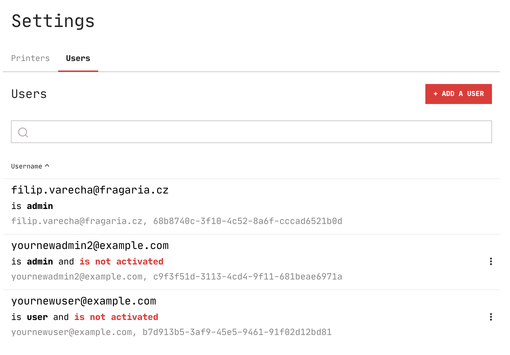
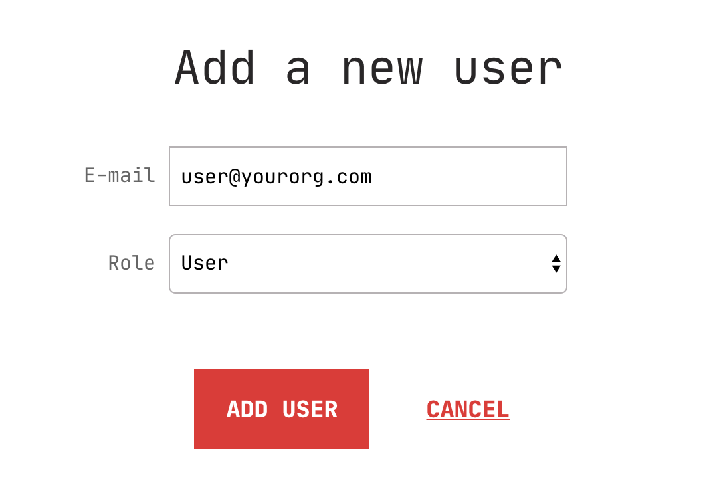
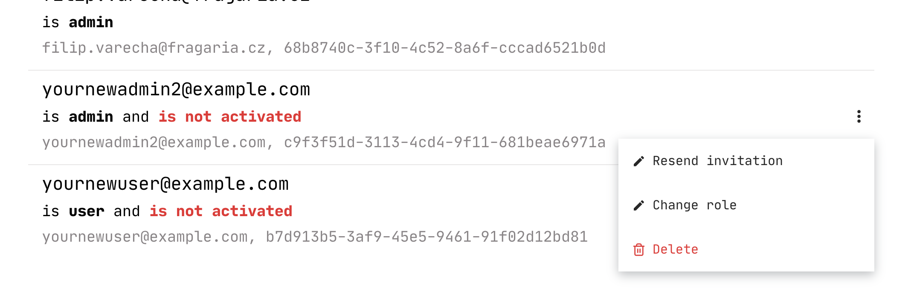
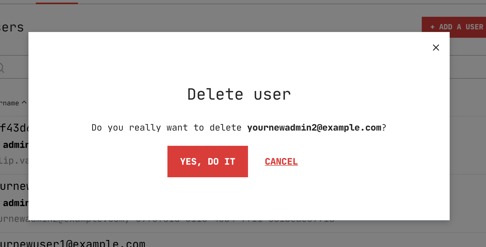
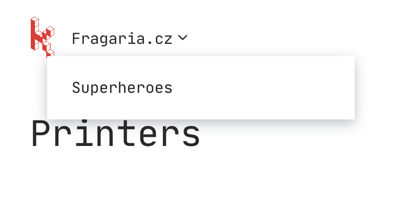
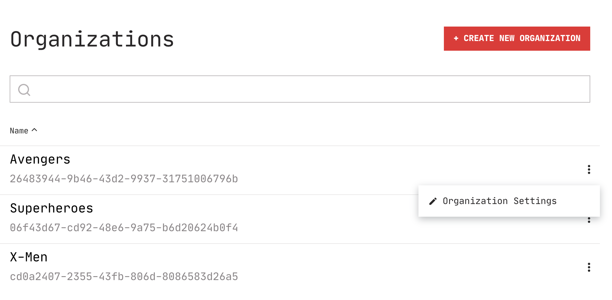

# Managing access & organizations

Like most software, Karmen has a built-in concept of *users*. Without a valid
user session, you won't be able to work with Karmen. Users are grouped into
*organizations*. In each organization, users can have one of the two roles:
*users* or *administrators*.

## Administrators

Administrator is a super user that can manage printers and their settings and
also manage other users in the organization.

## Users

Common users can see a use all the printers organization administrator has
previously added. They can also access the shared gcodes library, upload new
gcodes and trigger print jobs on the printers.

## Managing users

Users can be managed by administrators in the application settings (click on
*Settings* in the app menu and switch to *Users* tab). Please note you can only
edit other users, not yourself.

### Adding new users

You can add new users with the **Add user** button. Enter his/hers email address
and select his role.

After confirming, an invitation email will be sent to his/hers mailbox with an
activation link that first needs to be clicked to verify the email adress really
exists. Until then, the user will be listed as **not activated** in the user list.

If invitation didn't arrive, you can try re-sending it using the context menu on the user
list page.

### Changing user role

User role can be changed in the user context menu on the user list page. Since roles are binary at the moment, you can
only switch to the other role.

### Deleting users

Existing users can be deleted in the user context menu on the user list page for
the respective user record (except yourself).

After clicking **Delete**, a confirmation box will appear to make sure you are
indeed serious about that. If you change your mind later on anyway, you will
have to [invite the user again](access.md?id=adding-new-users).

## Managing organizations

Organizations group two things in fact:

- users
- printers

Thus, they allow you to *logically group your printer fleet* along with
operators to keep it busy. You can create arbitrary number of organizations
without any limitation.

!> Default organization is automatically created for you once you sign up.

### Switching organizations

You can easily switch organization you work with using the organization switcher
at the top left of the app screen:

This is available to both common users and administrators.

### Creating new organizations

New organizations can be added on the [organizations list
page](https://cloud.karmen.tech/organizations) with the **Create new
organization** button. Select an appropriate name like `Superheroes` and confirm
the action with **Add organization** button.

### Changing organization name

You can change name of any organization where you've been given the
administrator role. To change the name, navigate to the organization list and
click **Organization settings** link in the context menu (three dots icon) for the
organization you want to change.

