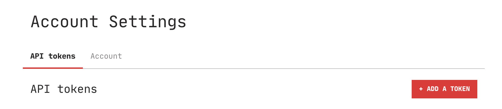
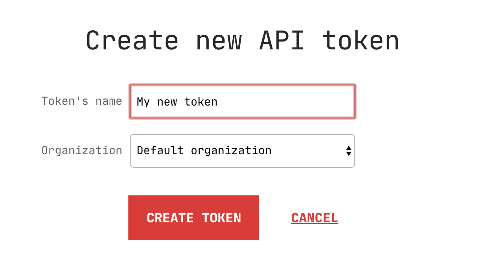

# API tokens

Sometimes, you need to access the application automatically—for example to run
a monitoring dashboard or to access the API programatically. For that, Karmen
offers API tokens tied to a certain user account and organization. Everyone can
create as many tokens as they want. The API tokens have following
properties:

- They never expire.
- They always have the *user* role, you cannot use them for adding printers
  for example.
- They are bound to a single specific organization.
- They can be revoked from the application.

!> The tokens are signed by the application and if you change the
``KARMEN_SECRET_KEY`` value in your configuration, they will stop working. Be
careful not to break existing integration when changing the secret key.

You can create new API token in your account settings (click on your account in the app menu).

<div class="center">



</div>

Click on the **Add token** button, name your new API token and select
organization for which it should be available.

<div class="center">



</div>

## Running a monitoring dashboard {docsify-ignore}

For the monitoring dashboard use case, you can run the UI in your browser
directly with the token like this:

```bash
http://<karmen-address>/?token=<my-api-token>
```
