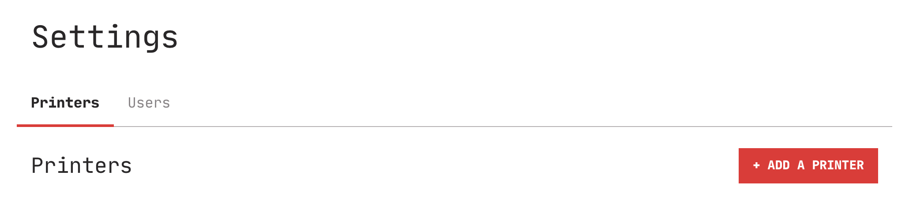

# Connecting your devices

Printer connection will depend on your 3D printer brand and type. Most printers
come with an **USB interface** that allows you to connect a controller that will handle
the printing instructions and basically remove the need for SD cards to transfer
your gcode files.

!> Karmen currently supports Karmen Pill and OctoPrint. We definitely plan to
extend the list of options and support smart printers in the future, too.

## Connecting Karmen Pill

The easiest option to connect your printer is using our **Karmen Pill**
companion box. See [Getting started with Pill](pill-getting-started.md) guide that will
lead you through it.

## Connecting OctoPrint-enabled devices

For hobbyists, the de-facto standard for making your 3D printer accessible over the network
is [OctoPrint](https://octoprint.org). Its installation can be greatly
simplified by using a Raspbian-derived image with a pre-configured installation
called [OctoPi](https://github.com/guysoft/OctoPi) that is designed for Raspberry Pi
microcomputers. Of course, in order for things to work, you will need to make sure your
OctoPrint instance is **accessible over the network** and **write down its IP address**.

!> OctoPrint is currently supported only when running Karmen on your [own
server](on-premise.md). The reason behind this is *networking*. In order to
avoid complicated settings on you router, the Karmen SaaS needs a special [web
socket proxy](https://github.com/fragaria/websocket-proxy) to be running on the
controller device. We plan to describe how to setup this in near future so that
you will be able to connect your existing devices, too.

### Adding your OctoPrint printer to Karmen

Once you have you OctoPrint box ready and available, you can add it on the Settings page. Navigate to the Settings
using the menu toggle and then click on "Add a printer" button.

You will be asked to enter you OctoPrint instance address. Make sure you enter
the IP address mentioned above. After submitting the form, your OctoPrint
instance setup is finished. In case your OctoPrint is password-protected (which
is always a good idea!), see the next section.

### Instances with Access Control

In case your instance have [Access
Control](http://docs.octoprint.org/en/master/features/accesscontrol.html#sec-features-access-control)
enabled, you will need to provide Karmen with an API key to use in order to
[authorize
Karmen](http://docs.octoprint.org/en/master/api/general.html#authorization)
requests with your OctoPrint instance. API key can be obtained using the Application Keys Plugin as mentioned
in the [OctoPrint docs](http://docs.octoprint.org/en/master/bundledplugins/appkeys.html#sec-bundledplugins-appkeys).

Once you have your token ready, set it in the Karmen printer settings menu.

!> Option to set the API key will only be displayed, if the OctoPrint is actually password-protected.
