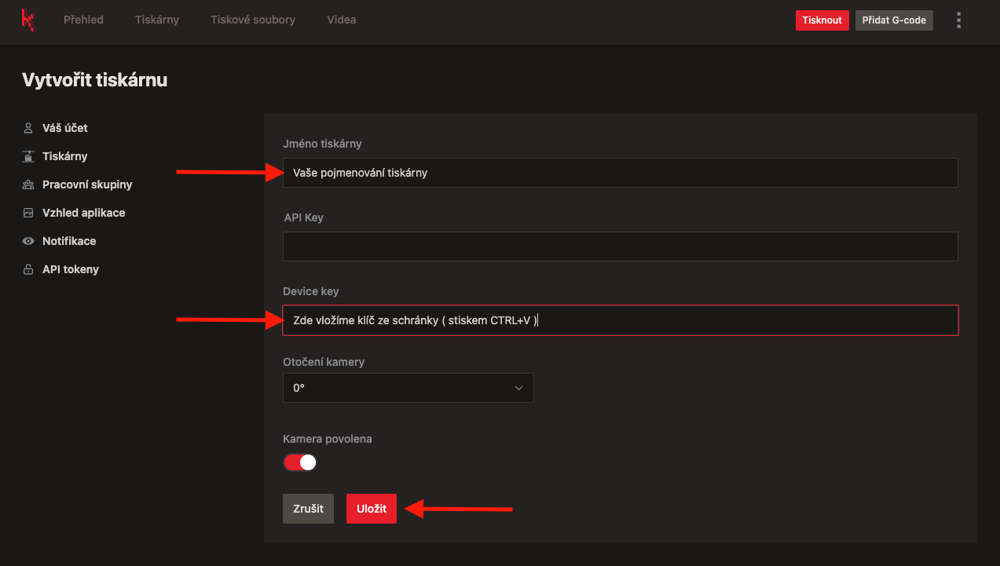

# Karmen Connector - Klipper

Pokud máte vlastní zařízení s Klipperem, můžete ho do Karmen Cloudu připojit snadno a rychle.

## Moonracker - průvodce nastavením krok za krokem
### Přihlášení přes SSH
Přihlaste se do svého zařízení pomocí SSH.  

### Vytvoření klíče zařízení
Klíč získáte po přihlášení do Karmen Cloudu na stránce nastavení: [https://next.karmen.tech/settings/account](https://next.karmen.tech/settings/account)   
Zde hledejte tlačítko "**Vytvořit nový klíč zařízení**"

Po kliknutí na toto tlačítko se Vám vygeneruje klíč, který si zkopírujte, je potřebný pro instalaci přes SSH skript.

### Spuštění SSH instalačního skriptu
Nyní zadáte do SSH přikaz skládající se ze dvou částí
- příkaz na spuštění skriptu instalace `curl -s https://raw.githubusercontent.com/fragaria/karmen-gists/main/ws-install.sh | sudo bash -s `  
- vytvořený klíč zařízení 

?> V našem ukázkovém přikladu tedy je `curl -s https://raw.githubusercontent.com/fragaria/karmen-gists/main/ws-install.sh | sudo bash -s eyJhbGciOiJIUzI1NiJ9.AToxNjgxMjk1Mjk5NDMxOmtjZjp2MjpvdjllM293bA.p4uQQJPi_YG_y7FR_wkJX8FvaiZ`

#### Takto připravený skript spustíme.

### Přidání vaší tiskárny do Karmen pracovní skupiny
V prohlížeči jdete na [next.karmen.tech](https://next.karmen.tech) a přihlaste se do svého účtu.
Klikněte na **Přidat tiskárnu**.  

Pokud již máte dříve přidanou tiskárnu bude pouze potřeba v sekci [Tiskárny](https://next.karmen.tech/printers) kliknout na tlačítko **Tlačítko přidat tiskárnu**.  

#### Výběr typu zařízení - Klipper  
Dále jste dotázání na typ zařízení. V tomto případě klikneme na **Klipper**.

#### Údaje tiskárny
Nyní vyplňte údaje tiskárny.  
`Název tiskárny` název, pod kterým se vám tiskárna bude zobrazovat.  
`DEVICE KEY` klíč zařízení jsme vytvářeli v druhém kroku.  
*Volitelné - pokud jste upravili a zvýšili zabezpečení*  
`API Key` je sekundární API klíč  

### Máme hotovo a jdeme tisknout

## Dohledání Karmen klíče zařízení
Pokud by jste po instalaci smazali tiskárnu nemůsíte znovu instalovat.  
Klíč se vám uložil do textového souboru a níže vám ukážeme jak se k němu dostanete dvěma kroky.  
Vstupte do rozhraní Klipperu - naše ukázka **FLUID**.  
Zde do sekce **Configuration**  

Zde po otevření souboru `karmen-key.txt` najdete vás klíč.

# Kontakt a podpora
Budeme moc rádi za všechny připomínky nebo dotazy. Ozvěte se nám na email karmen@karmen.tech. Děkujeme za zájem i podporu!
