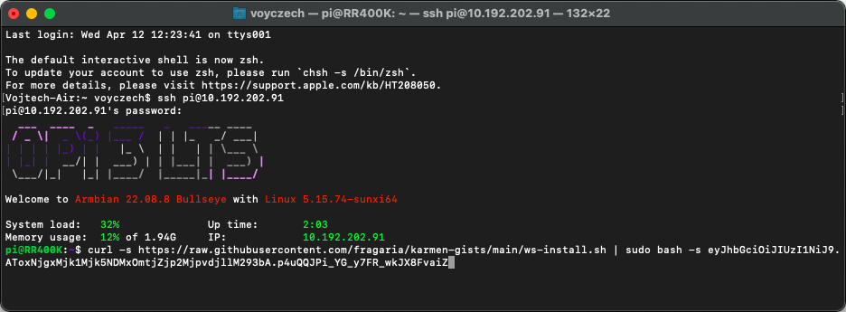

    Tato stránka již není aktualizována. Prosím navštivte aktuální stránky dokumentace:
    

        <a href="https://karmen.tech/docs/" style="font-weight: bold; color: #fff;">https://karmen.tech/docs/</a>
    

# Karmen Connector - Klipper (Moonracker)

Pokud máte vlastní zařízení s Klipperem, můžete ho do Karmen Cloudu připojit snadno a rychle.

## Předpoklad
- zařízení s Klipperem - Moonracker
- účet na [next.karmen.tech](https://next.karmen.tech)

## Průvodce nastavením krok za krokem
### Přihlášení přes SSH
Přihlaste se do svého zařízení pomocí SSH.  

### Vytvoření klíče zařízení
Klíč získáte po přihlášení do Karmen Cloudu na stránce nastavení: [https://next.karmen.tech/settings/account](https://next.karmen.tech/settings/account)   
Zde hledejte tlačítko "**Vytvořit nový klíč zařízení**"

### Zkopírování klíče
Po kliknutí na toto tlačítko se Vám vygeneruje klíč, který si zkopírujte, je potřebný pro instalaci přes SSH skript.

### Spuštění SSH instalačního skriptu
Nyní zadejte do SSH přikaz skládající se ze dvou částí
- Příkaz na spuštění skriptu instalace `curl -s https://raw.githubusercontent.com/fragaria/karmen-gists/main/ws-install.sh | sudo bash -s `  
- Vytvořený klíč zařízení `eyJhbGciOiJIUzI1NiJ9.AToxNjgxMjk1Mjk5NDMxOmtjZjp2MjpvdjllM293bA.p4uQQJPi_YG_y7FR_wkJX8FvaiZ` 

?> V našem ukázkovém přikladu tedy je `curl -s https://raw.githubusercontent.com/fragaria/karmen-gists/main/ws-install.sh | sudo bash -s eyJhbGciOiJIUzI1NiJ9.AToxNjgxMjk1Mjk5NDMxOmtjZjp2MjpvdjllM293bA.p4uQQJPi_YG_y7FR_wkJX8FvaiZ`

**Takto připravený skript spustíme**.

### Přidání tiskárny do pracovní skupiny v Karmen
Pokud nemáte ještě přidánu tiskárnu, Karmen Vás k tomu na hlavní stránce [next.karmen.tech](https://next.karmen.tech) vyzve.  

Další tiskárnu přidáte v záložce [Tiskárny](https://next.karmen.tech/printers) stiskem tlačítka **Přidat tiskárnu**.  

#### Výběr typu zařízení - Klipper  
V dalším kroku zvolte typ zařízení, v tomto případě **Klipper**.

#### A vyplňte několik údajů:  
`Název tiskárny` název, pod kterým se vám tiskárna bude zobrazovat.  
`Device key` klíč zařízení jsme vytvářeli v druhém kroku.  

## Dohledání Karmen klíče zařízení
Device key máte uložen pro Vaše potřeby v Klipperu i do budoucna. Najdete jej v souboru `karmen-key.txt` v sekci **Configuration**.

# Kontakt a podpora
Budeme moc rádi za všechny připomínky nebo dotazy. Ozvěte se nám na email [karmen@karmen.tech](mailto:karmen@karmen.tech). Děkujeme za zájem i podporu!
