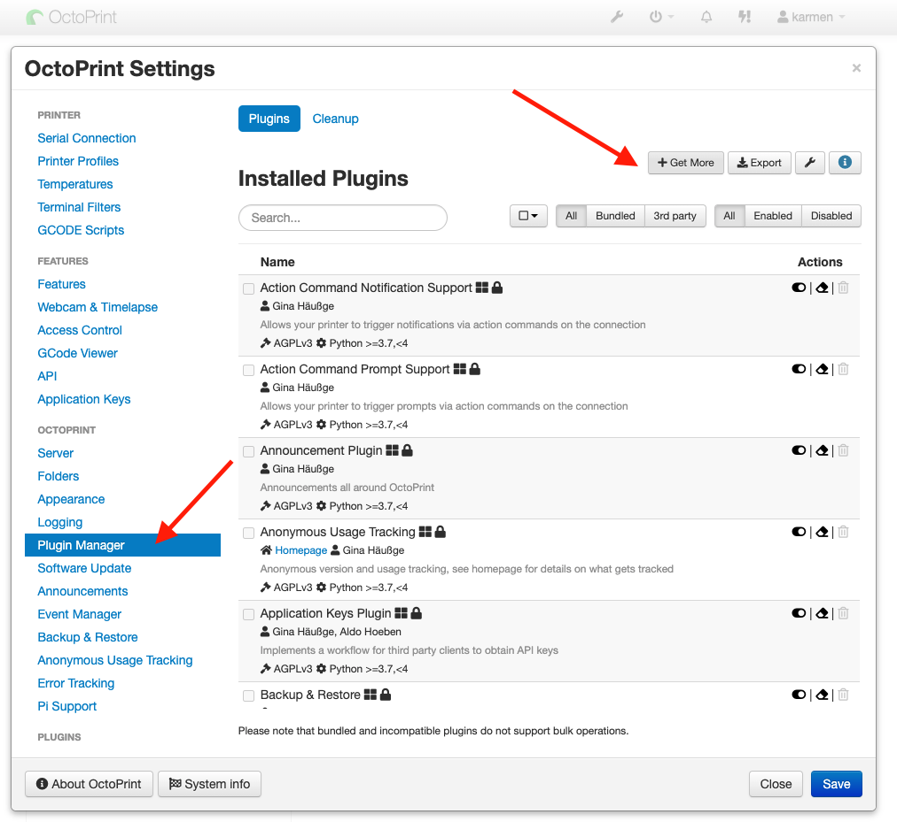
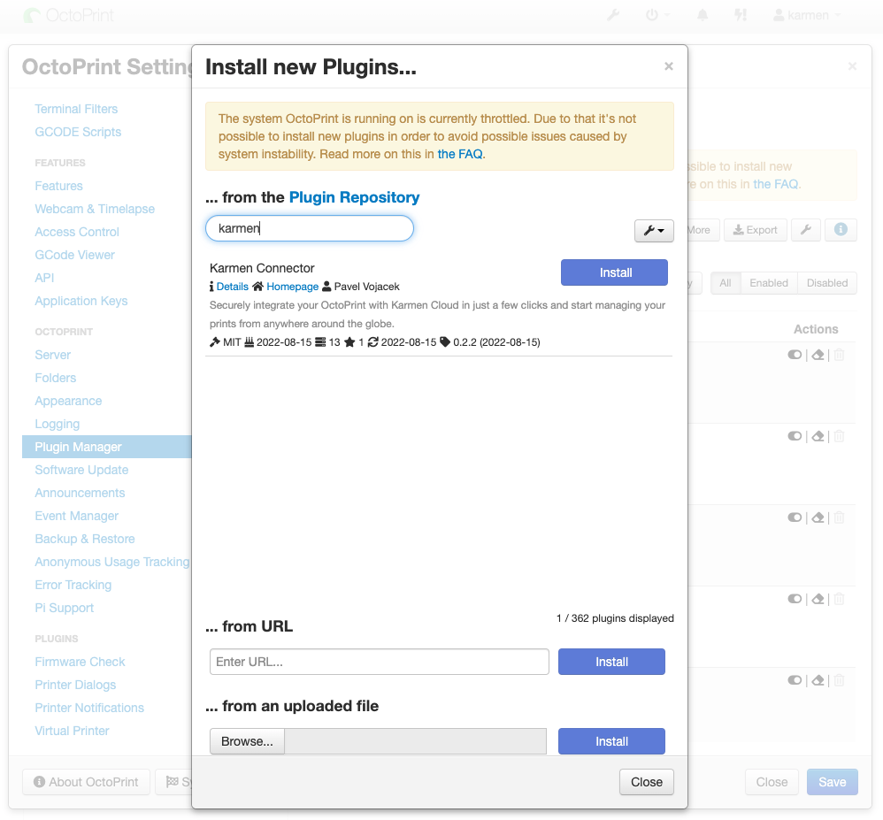
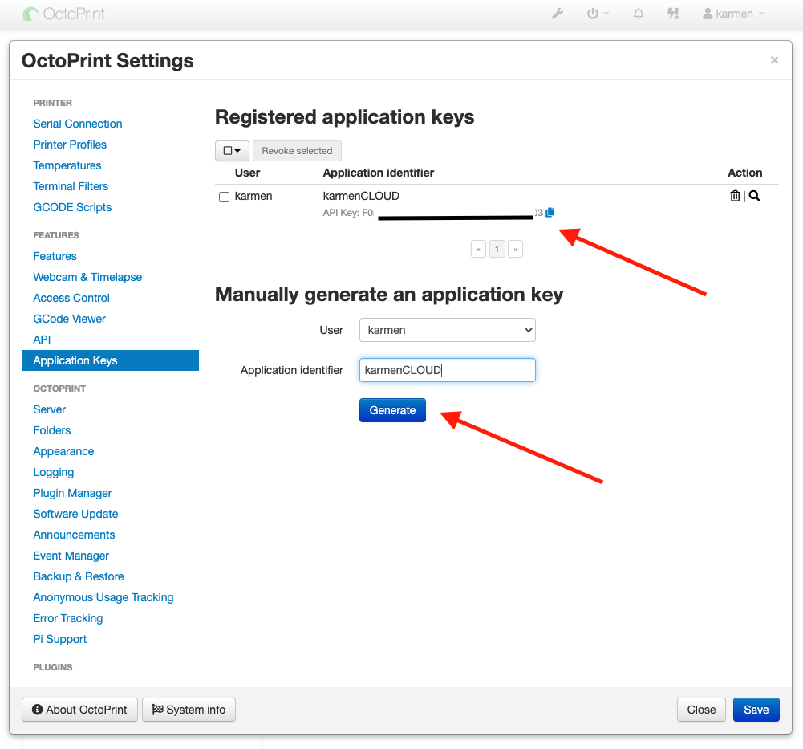
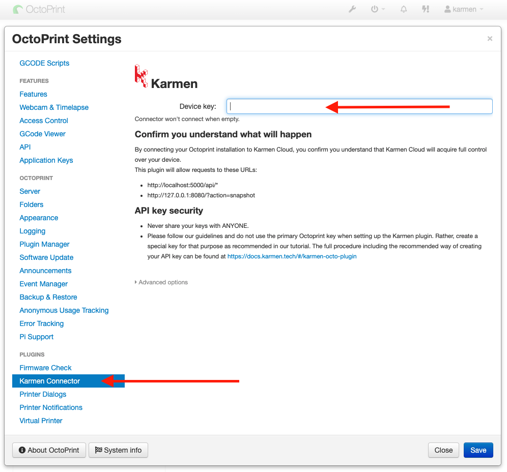

    Tato stránka již není aktualizována. Prosím navštivte aktuální stránky dokumentace:
    

        <a href="https://karmen.tech/docs/" style="font-weight: bold; color: #fff;">https://karmen.tech/docs/</a>
    

# Karmen Connector - Octoprint Plugin

Pokud máte vlastní zařízení s Octoprintem, můžete ho do Karmen Cloudu připojit také.

Níže je uveden návod, jakým způsobem nainstalovat Octoprint a další potřebné knihovny k tomu, aby vaše vlastní zařízení komunikovalo s [Karmen Cloudem](https://next.karmen.tech/).

## Předpoklad
- zařízení s Octoprintem
- účet na [next.karmen.tech](https://next.karmen.tech)

## Průvodce nastavením krok za krokem
### Instalace Karmen Connector pluginu
Přihlaste se do svého octoprint zařízení jako **admin** - účet administrátora.  
Jdetě do Settings => Plugin Manager a vyberte "**GET MORE**"  

Vyhledejte Karmen Connector plugin a nainstalujte ho  

!> Nyní budete vyzváni k restartování zařízení pro dokončení instalace. Jdeme tedy na to!

### Vytvoření sekundárního API klíče Octoprint
!> Silně nedoporučujeme  používat hlavní Master API key. Prosím pro propojení s Karmen si vytvořte nový separátní API klíč.

Jděte do Settings => Application keys  
Zde si při vytvoření můžete sekundární API klíč i pojmenovat.
My jsme zvolili `karmenCLOUD` pro lehké naleznutí v budoucnu.

### Přidání vaší tiskárny do Karmen pracovní skupiny
V prohlížeči jdete na [next.karmen.tech](https://next.karmen.tech) a přihlaste se do svého účtu.
Klikněte na **Přidat tiskárnu**.  
Pokud již máte dříve přidanou tiskárnu bude pouze potřeba jít do `Nastavení` => `Tiskárny` => **Tlačítko přidat tiskárnu**.  

#### Výběr typu Octoprint zařízení  

#### Údaje tiskárny
Nyní vyplňte údaje tiskárny.  
`Název tiskárny` název, pod kterým se vám tiskárna bude zobrazovat.  
`Octoprint API Key` je sekundární API klíč, který jsme si dříve generovali v Octoprintu.

Po stisknutí tlačítka vám bude vygenerován unikátní klíč zařízení.  
Tento klíč bude potřeba zadat do nastavení pluginu `Karmen Connector`.

### Zadání klíče do pluginu
Jděte do Nastavení => Karmen Connector plugin a po vyplnění `Device key` uložte.

# Kontakt a podpora
Budeme moc rádi za všechny připomínky nebo dotazy. Ozvěte se nám na email karmen@karmen.tech. Děkujeme za zájem i podporu!
