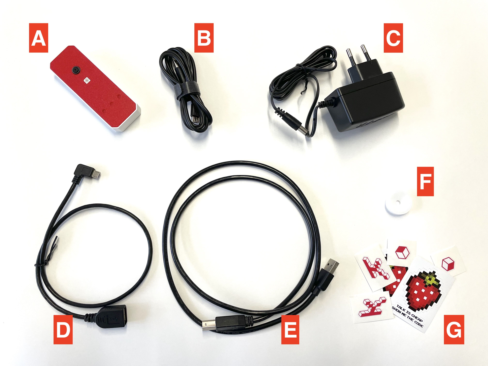

# Karmen Pill

## Obsah balení

- **A**: Krabička Karmen Pill
- **B**: Propojovací USB kabel pro připojení Karmen Pill s počítačem a úvodní nastavení wifi
- **C**: Napájecí adaptér
- **D+E**: Kabely k propojení Karmen Pill a 3D tiskárny
- **F**: Ostřící kolečko na kameru
- **G**: Pár našich samolepek :-)

<borderedImage></borderedImage>

## Rozpoznání typu Pillu

Zejména z důvodu nedostatku čipů a jednotlivých komponent vyrábíme a dodáváme několik typů Pillu. V následující sekci
je popsáno, jakým způsobem můžete jednotlivé modely rozeznat. Rozpoznání správného typu je důležité, protože se
může lišit způsob prvotní konfigurace a nastavení Pillu.

### Karmen Pill (nejrozšířenější model)

- malý micro USB konektor
- volitelně napájecí konektor (liší se podle verze)
- volitelně možnost vyjmutí SD karty (liší se podle verze)

[>> Úvodní nastavení pro tento model a připojení do Karmen](/cs/karmen-pill-nastaveni.md)

### Karmen Pill V2

- označena na zadní straně nápisem "v2"
- malý micro USB konektor
- napájecí konektor

[>> Úvodní nastavení pro tento model a připojení do Karmen](/cs/karmen-pill-v2-pill-xl-nastaveni.md)

### Karmen Pill XL

- větší model se dvěmi LED světly
- velký (USB A) konektor

[>> Úvodní nastavení pro tento model a připojení do Karmen](/cs/karmen-pill-v2-pill-xl-nastaveni.md)
