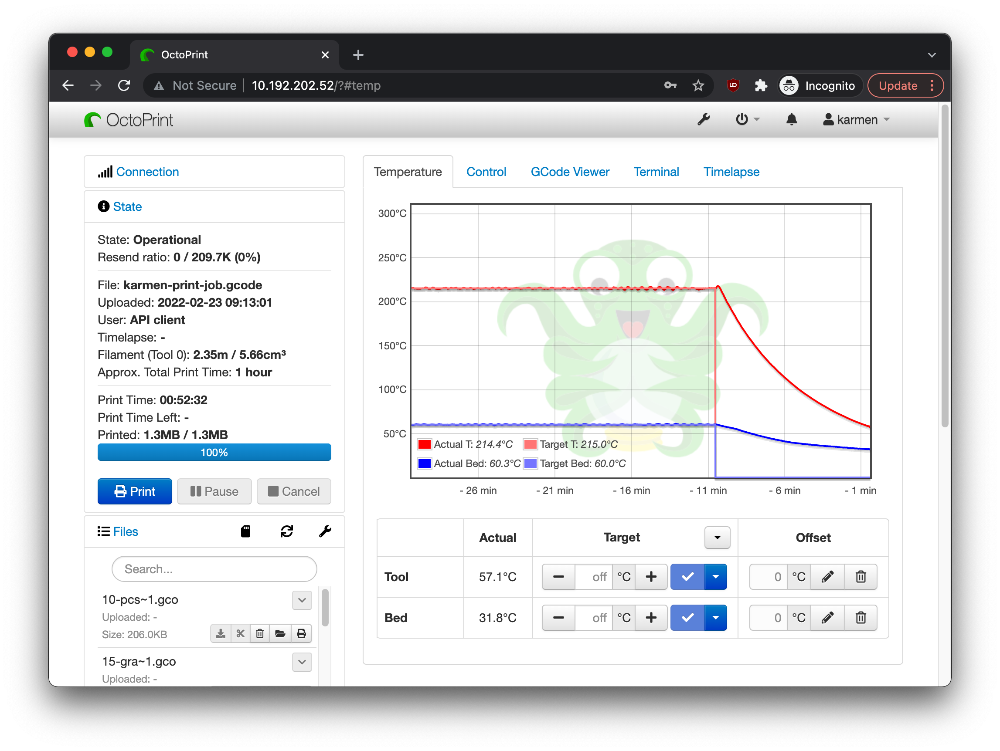
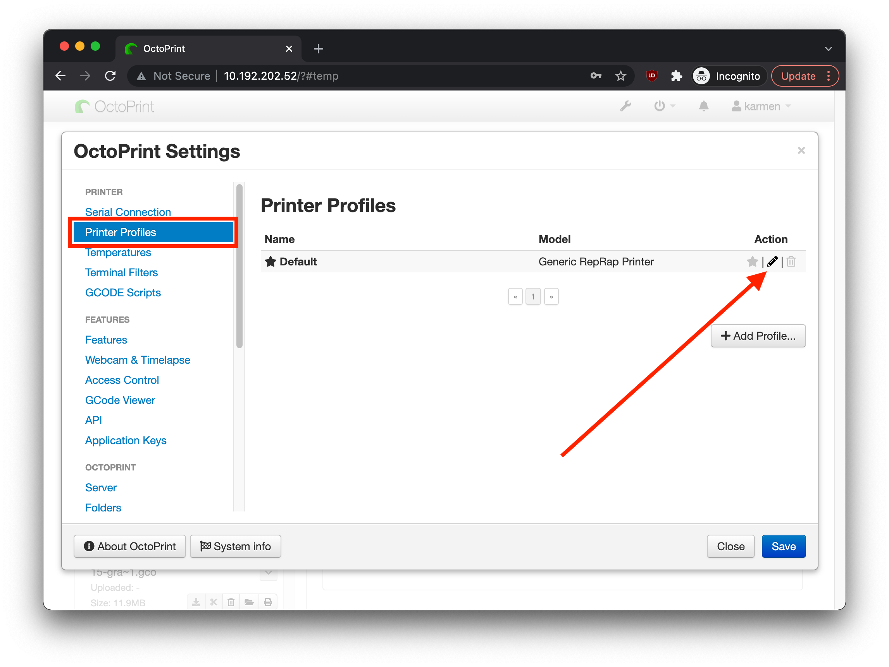
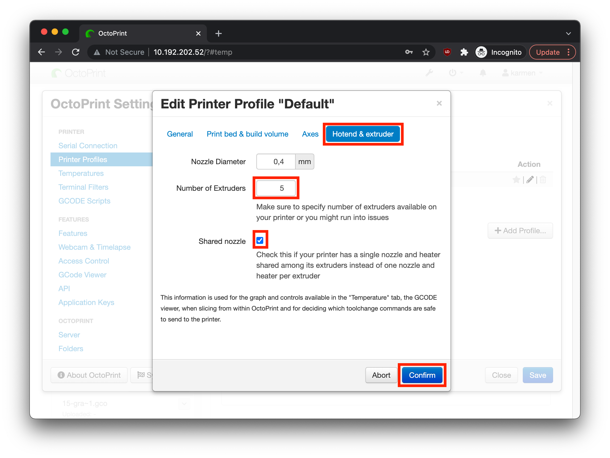

    Tato stránka již není aktualizována. Prosím navštivte aktuální stránky dokumentace:
    

        <a href="https://karmen.tech/docs/" style="font-weight: bold; color: #fff;">https://karmen.tech/docs/</a>
    

# Konfigurace Karmen Pillu (Octoprintu) pro podporu MMU na Prusa tiskárnách

Pokud máte u své Prusa MK* tiskárny rozšíření MMU (multimateriál) a zkoušíte tisknout přes Karmen, pravděpodobně jste se dostali do stavu,
že tiskárna tiskne, ale nemění materiál. Aby k výměně materiálu během tisku došlo, je potřeba provést úpravu v nastavení Octoprintu, který je nainstalován na Pillu. V následujících několika krocích si ukážeme, jak na to.

### Zjištění lokální IP adresy Karmen Pill

Na Octoprint, který je nainstalován na Pillu, je možné se připojit *(pouze)* z lokální Wifi sítě. Proto je potřeba zjistit
IP adresu Karmen Pillu. Adresu zjistíte například v seznamu zařízení na Vašem Wifi routeru nebo "proskenováním" lokální sítě.

?> Pokud byste nevěděli, jak IP adresu zařízení zjistit, tak se obraťte na svého síťového administrátora nebo se nám
ozvěte na karmen@karmen.tech a my Vám pomůžeme.

> Pracujeme na tom, aby bylo možné provést nastavení MMU i přímo z Karmen Cloudu.

### Připojení na Octoprint a potřebná nastavení pro funkčnost MMU

Pokud znáte IP adresu Karmen Pillu, tak je připojení na Octoprint velmi jednoduché - IP adresu zadejte do internetového prohlížeče. Například tedy:

?> http://192.168.1.123/

Pokud je vše v pořádku, je zobrazena stránka s Octoprintem:

Nyní klikněte na ikonku , zobrazí se okno s nastavením.
Zde v levém menu vyberte "Printer Profiles" a následně klikněte na ikonu pro editaci "Default" profilu tiskárny, viz následující obrázek:

Nyní vše nastavte dle obrázku níže a změnu potvrďte tlačítkem "Confirm" - na další stránce klikněte na "Save".

To je vše! Vyzkoušejte tisk z multimateriálu, zda vše funguje jak má.

?> Pokud byste náhodou chtěli tisknout bez MMU, můžete s Karmen Pillem tisknout i s tímto nastavením pro MMU.

> Pokud narazíte na nějaké problémy, dejte nám prosím vědět na karmen@karmen.tech. Samozřejmě budeme i moc rádi, pokud nám napíšete, že vše funguje jak má :-)
