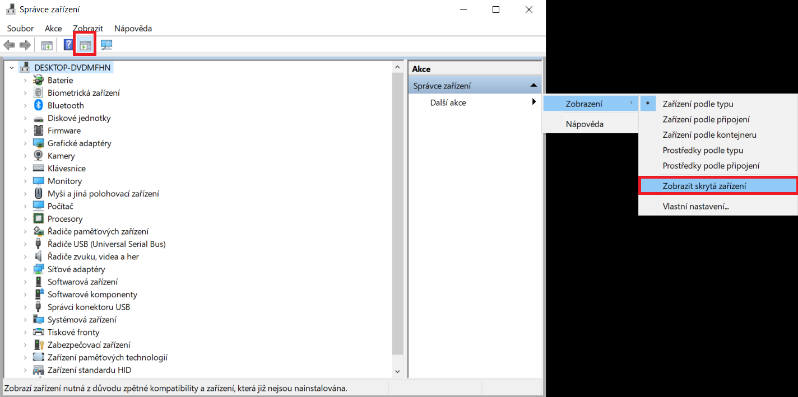

<div style="background: #ea272e; color: #fff; padding: 10px; margin-bottom: 50px; font-size: 20px; text-align: center;">
    Tato stránka již není aktualizována. Prosím navštivte aktuální stránky dokumentace:
    <div style="margin: 20px 0 20px 0;">
        <a href="https://karmen.tech/docs/" style="font-weight: bold; color: #fff;">https://karmen.tech/docs/</a>
    </div>
</div>

# Nastavení Portu COM a LPT

Pokud byste možnost ```PORTY (COM A LPT)``` neviděli, ujistěte se, že používáte kabel pro přenos dat (ne jen pro nabíjení). Můžete také kliknout na ```Zobrazit/skrýt seznam akcí``` nahoře v menu, kliknout na ```Další akce```, ```Zobrazení``` a ```Zobrazit skrytá zařízení```. Až se Vám porty objeví, dáte aktualizovat.

<borderedImage></borderedImage>