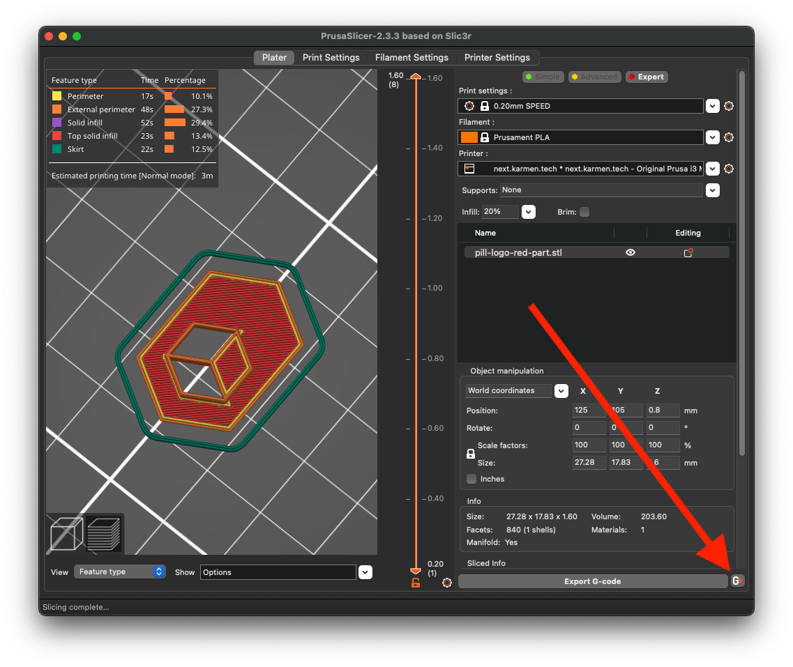

# Nastavení PrusaSliceru s Karmen

Pokud používáte ke slicování [PrusaSlicer](https://www.prusa3d.com/prusaslicer/), určitě Vás bude zajímat,
jakým způsobem můžete nahrát své Gcody z PrusaSliceru přímo do Karmen.

## Vytvoření API klíče

Aby mohl PrusaSlicer komunikovat s Karmen (odesílát Gcody), musíme si nejdříve v Karmen vygenerovat API klíč.
API klíč si vytvoříte po přihlášení v Karmen Cloud na stránce [Account Settings > API tokens](https://cloud.karmen.tech/users/me/tab-api-tokens).

Stačí zadat libovolný název klíče a kliknout na tlačítko “CREATE TOKEN”.

<borderedImage></borderedImage>

Následně se zobrazí stránka s klíčem, který si zkopírujte (CTRL+C).

<borderedImage></borderedImage>

## Nastavení PrusaSliceru

V záložce PrinterSettings nastavte následující:

- Hostname: ```https://cloud.karmen.tech/api/octoprint-emulator/```
- API Key: ```klíč, který jste si zkopírovali v předchozím kroku```

<borderedImage></borderedImage>

Nyní, když mám vyslicovaný model, tak vidím tlačítko odeslání tisku do Karmen:

<borderedImage></borderedImage>


