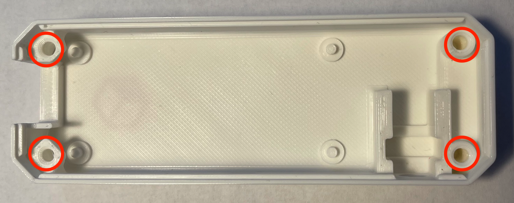
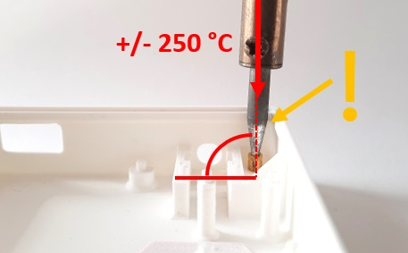
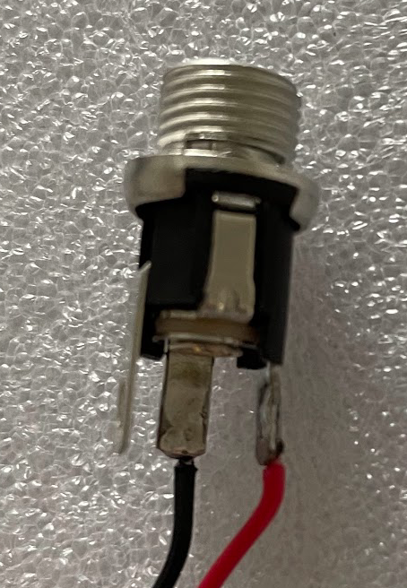
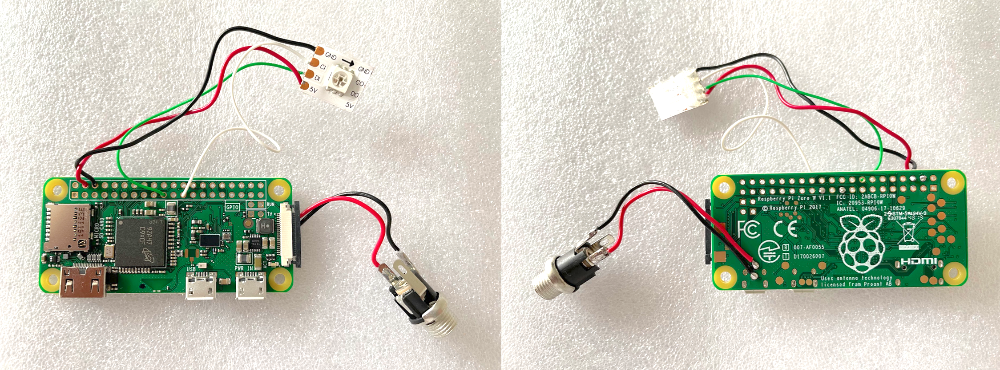
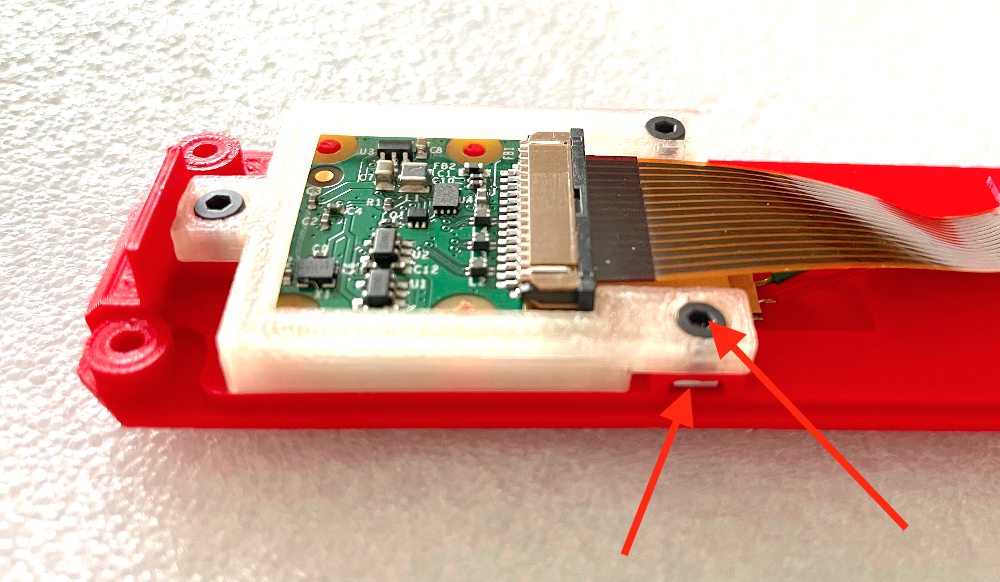
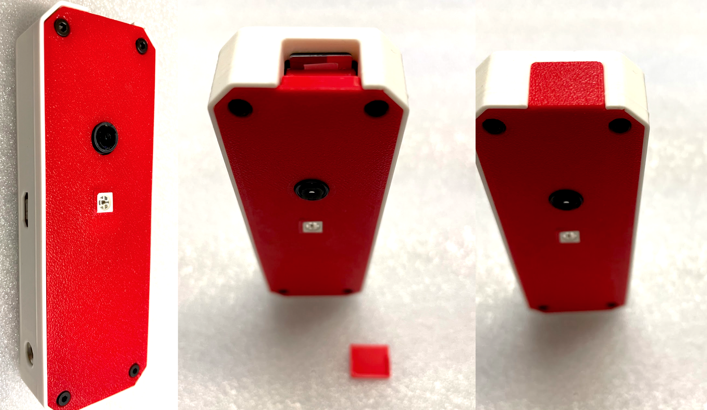

# Jak si sestavit vlastní Karmen Pill

Gratulujeme k tomu, že jste se rozhodli postavit vlastní Karmen Pill! Na dalších řádcích naleznete podrobný návod, jak postupovat při jejím sestavování.

## Obsah balení

- **A**: Sada vytištěných dílů Karmen Pill
    - A1: Spodní část krabičky
    - A2: Víčko
    - A3: Držák kamery
    - A4: Venkovní krytka SD karty
- **B**: Kamera s kabelem a ostřící kolečko
- **C**: Napájecí adaptér
- **D**: LED - 1ks
- **E**: Spojovací materiál
    - 4ks - závitové vložky M2 (délka 4mm)
    - 7ks - šrouby M2x4 (DIN 912)
    - 3ks - čtercové matice M2
- **F**: Napájecí konektor
- **G**: Sada vodičů k připojení LED
- **H**: Sada vodičů k připojení napájecího konektoru
- **I**: Základní deska (Raspberry Pi Zero W nebo Raspberry Pi Zero 2)
- **J**: Propojovací USB kabel pro připojení Karmen Pill s tiskárnou
- **K**: SD karta se systémem

<borderedImage></borderedImage>

## Potřebné vybavení

- Pájka (nejlépe mikropájka s úzkým hrotem)
- Cínová pájka (cín)
- Pomocné držáky pro pájení (třetí ruka)
- Imbus velikost 1.3 mm

## Lisování závitových vložek

Součástí stavebnice jsou závitové vložky, takže Pill je možné opakovaně složit i rozebrat.

### Pozice závitových vložek

 Umístění závitových vložek je následující - viz obrázek níže.

<borderedImage></borderedImage>

### Způsob lisování

Nejlepší způsob jak vlisovat závitové vložky je za pomoci pájky. Nahřejte pájku zhruba na 250°C a opatrně umístěte závitovou vložku na její hrot. Tím se vložka rychle zahřeje a vy budete schopni nalisovat vložky bez rizika popraskání plastových dílů.

!> Při lisování musí být pájka v jedné ose se závitovou vložkou a otvorem, do kterého je vložka lisována (jinými slovy kolmo na dno krabičky).

<borderedImage></borderedImage>

!> Každá závitová vložka musí být zalisována po celé délce tak, aby nevyčnívala.

## Pájení

Karmen Pill má LEDku a napájecí konektor pevně spojen se základní deskou.

!> Dodržte barevné uspořádání vodičů, jak je znázorněno na obrázcích.

### Zapojení LED

Na obrázku níže je zvýrazněna šipka, která ukazuje směr zapojení vodičů, resp. otočení LEDky. Dejte pozor, abyste připojili vodiče na LED ze správné strany.

<borderedImage></borderedImage>

### Zapojení napájecího konektoru

Konektor má 3 vidlice, z toho budou potřeba pouze 2 - prostřední pro připojení černého vodiče a pravá pro připojení červeného vodiče.

!> Dejte pozor na správné zapojení. V případě prohození +/- může dojít ke zničení Raspberry. Pokud byste si nebyli jisti, zda máte vše zapojeno správně,
tak použijte k ověření multimetr.

<borderedImage></borderedImage>

### Zapojení vodičů k základní desce

Pro vodiče napájecího konektoru slouží testovací pady na spodní straně Raspberry. Mezi "Raspberry Zero W" a "Raspberry Zero 2" je drobný rozdíl v umístění padů, což je vidět na obrázku níže - zbytek zapojení je stejný.

!> Při pájení vodičů od napájecího konektoru dodržte směr vedení vodičů, jak je označeno na obrázku - předejdete tak jejich lámání při sestavování.

Pro LED vodiče slouží standardní Raspberry piny - způsob jejich zapojení je opět vidět na obrázku. Vodiče věďte z horní části desky - na spodní straně desky by měl vodič vyčnívat jen minimálně, tak aby nebránil vložení do krabičky.

<borderedImage></borderedImage>

### Výsledek

Nyní by mělo vše vypadat cca následovně...

<borderedImage></borderedImage>

## Sestava

To nejtěžší bychom měli mít za sebou! Teď vše poskládáme dohromady.

### Připojení kamery

Nyní je čas připojit k Raspberry kameru. Dejte pozor, aby kabel v konektoru byl správně natočen - kontakty směrem dolů - jak u kamery, tak u Raspberry.
Nezapomeňte opatrně zajistit oba konektory, aby z nich kabel nevypadával.

<borderedImage></borderedImage>

### Montáž kamery do horní části krabičky

Pomocí tří šroubů a čtvercových matic, přišroubujte kameru do víčka krabičky.

<borderedImage></borderedImage>

### Vložení napájecího konektoru a Raspberry do krabičky

!> Ujistěte se, že SD karta není vložena do základní desky, v opačném případě by při sestavování mohlo dojít k jejímu poškození!

!> Při vkládání Raspberry buďte opatrní a dávejte pozor na konektor ke kameře na Raspberry - konektor se při chybné manipulaci může vylomit.

Nyní je čas vložit do krabičky samotné Raspberry. Postupujte tak, že nejprve zasuňte do krabičky tu část, kde je otvor pro SD kartu. Při vkládání je potřeba krabičku po stranách trochu prohnout směrem ven, aby tam Raspberry prošlo.

Když vše dobře sedí, tak zasuňte do pozice napájecí konektor.

Při vkládání Raspberry buďte opatrní a dávejte pozor na kamerový kabel a vodiče od napájecího konektoru, aby nebránili správnému "zapadnutí" Raspberry až do spodní části krabičky.

<borderedImage></borderedImage>

### Konečná montáž

Nyní přiložte víčko na krabičku a dotáhněte pomocí 4 šroubů. Dbejte na to, aby na sobě vše dobře "sedělo", případně zkuste porovnat vodiče a kabel od kamery,
aby nic z toho nebránilo hladkému sesazení.

### Finále

Jako úplně poslední krok vložte SD kartu a schovejte jí pod krytku.

<borderedImage></borderedImage>

---
---
---

## TODO:
- přidat odkaz na stažení STL pro tisk komponent krabičky
- instalace systému na SD kartu
- návod na přidání Pillu do Karmen Cloudu
