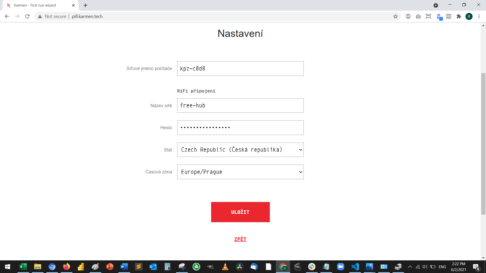
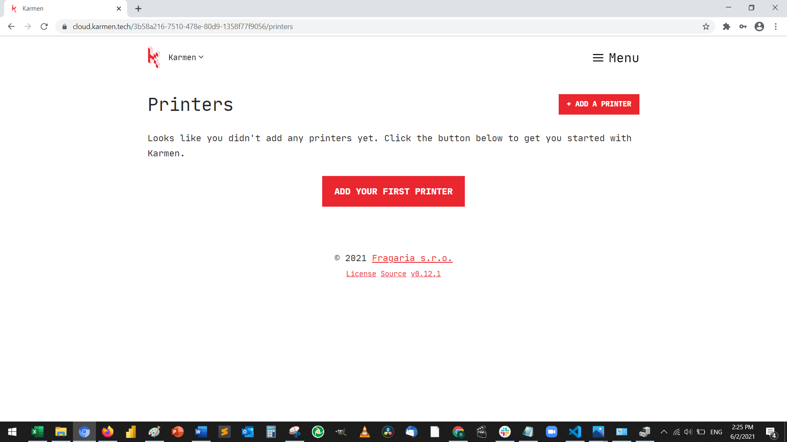
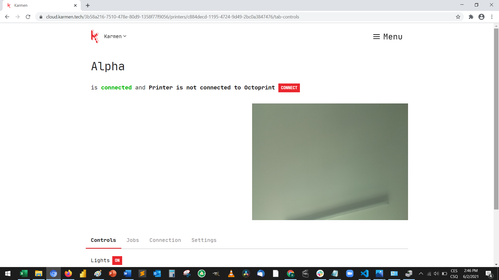
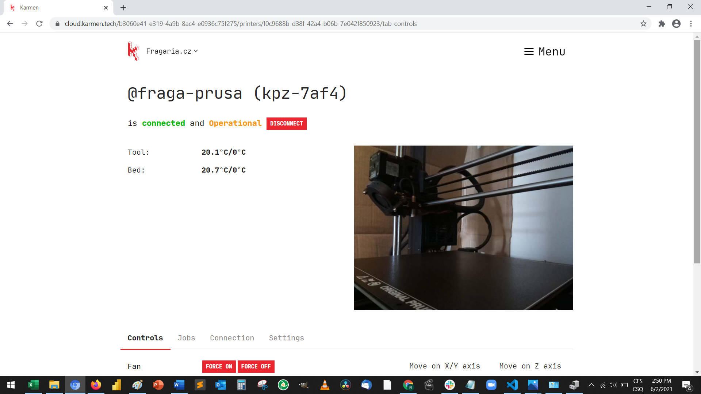
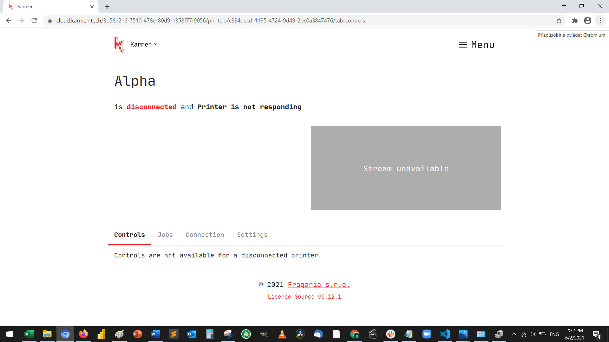

# Prvotní zapojení Karmen Pill na zařízení s Windows

Pokud používáte zařízení s operačním systémem Windows, bude nejprve nutné stáhnout ovladač, který na tomto operačním systému chybí. 

## Spojení Pillu s počítačem

Začněte tím, že připojíte svůj Pill k počítači dodaným USB kabelem (v případě použití vlastního kabelu dbejte na to, aby použitý kabel uměl přenášet data a nebyl pouze nabíjecí). 
Počkejte než se Pill modře rozsvítí a následně zhasne. 
Potom přejděte na URL pro [stažení ovladače](https://www.catalog.update.microsoft.com/Search.aspx?q=usb%20vid_0525%20pid_a4a2).

<borderedImage></borderedImage>

Následně se zobrazí stránka pro stažení ovladače. Ovladač stáhněte a zapamatujte si místo, kam ho ukládáte.

<borderedImage></borderedImage>

## Instalace ovladače

Klikněte pravým tlačítkem na Start a vyberte ```Správce zařízení```


<borderedImage></borderedImage>

Pod možností ```Síťové adaptéry``` se podívejte, že nevidíte "USB Ethernet/RNDIS Gadget". To je ovladač, který musíme nainstalovat.

<borderedImage></borderedImage>

Nyní rozklinete ```PORTY (COM A LPT)``` a kliknete pravým tlačítkem na ```Sériové zařízení USB``` a dáte aktualizovat.

<borderedImage></borderedImage>


!> Nevidíte PORTY (COM A LPT)? [Podívejte se sem](cs/porty.md).


Potom z nabízených možností zvolíte ```Vyhledat ovladače na mém počítači```.

<borderedImage></borderedImage>

A pomocí tlačítka ```Procházet``` najdete složku, kam jste stažený ovladač uložili (předtím bude nejspíš potřeba ho rozbalit) 


<borderedImage></borderedImage>

<borderedImage></borderedImage>

Nyní Pill odpojte a znovu připojte k počítači a ověřte si, že je vidět ```USB Ethernet/RNDIS Gadget``` v ```Síťových adaptérech```.

<borderedImage></borderedImage>


## Připojení Pillu k Wifi

Potom co se Pill opět rozvítí a následně zhasne přejděte v prohlížeči na stránku [pill.karmen.tech](http://pill.karmen.tech/) a zde nastavíte název pillu, dále potom jméno a heslo Vaší wifi, na kterou se má Pill připojit (použijte wifi 2.4GHz, ne 5GHZ).
V dalším kroku zkopírujete dlouhý kód, který se vam objeví. Budete ho potřebovat pro přidání tiskárny.

!> Stránka pill.karmen.tech se Vám stále nenačítá? Nejspíš budet muset dočasně **vypnout firewall**. [Podívejte se sem](cs/firewall.md).

<borderedImage></borderedImage>


## Spojení Pillu s tiskárnou

Nyní Pill odpojte od počítače a připojte k tiskárně. Zadejte adresu [cloud.karmen.tech] (https://cloud.karmen.tech/) a klikněte na ```add a printer```.

<borderedImage></borderedImage>

Poté zvolte název tiskárny a vložte kód, který jste zkopirovali v [pill.karmen.tech](http://pill.karmen.tech/).
Nyní můžete připojit Pill k tiskárně, počkejte, až se rozsvítí a zhasne.
Pak stále na [cloud.karmen.tech] (https://cloud.karmen.tech/) v menu ```Printers``` vyberte nově přidanou tiskárnu a rozkliknete ji. Pár minut počkejte a pak zkuste refreshnout stránku. Měli byste vidět obraz na kameře a následující obrazovku. 

<borderedImage></borderedImage>

Nahoře pod názvem tiskárny uvidíte ```Connect``` klikněte sem a nějakou dobu čekejte (může to trvat i pár minut). Pokud neuvidíte obraz na kameře, zkuste po chvíli refreshnout stránku obraz by se měl objevit. Stav tiskárny by měl být ```Connected and Operational```

<borderedImage></borderedImage>

!> Pokud obraz stále i po několika refreshích nevidíte a chybí Vám tlačítko CONNECT a obrazovka vypadá i po pár minutách a refreshi jako níže, Pill není připojen na wifi. Zkuste proto zkontrolovat kroky pro připojení na wifi.  

<borderedImage></borderedImage>


## Kompletní dokumentace Karmen Pill a Cloud

Odkaz na kompletní [návod ke Karmen Pillu a Cloudu a dokumentaci](https://docs.karmen.tech/#/pill-getting-started) najdete zatím pouze v angličtině. 

## Držáky na Pill k tisku

Pokud si budete na Pill chtít pořídit držák, mrkněte do knihovny, kterou vyrobili naši klienti.  

https://www.thingiverse.com/thing:4764591

https://www.thingiverse.com/thing:4267454

https://www.thingiverse.com/thing:4741938

https://www.thingiverse.com/thing:4361559

https://www.thingiverse.com/thing:4342073

## Kontakt

Kdyby cokoliv nevyšlo, ozvěte se na karmen@karmen.tech a s problémem Vám pomůžeme :)