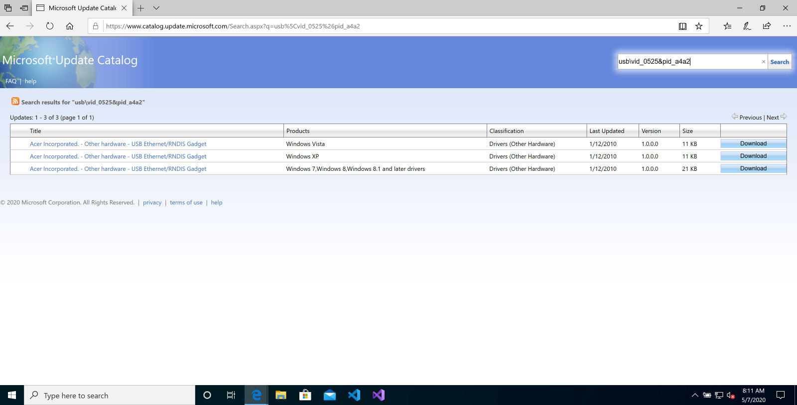
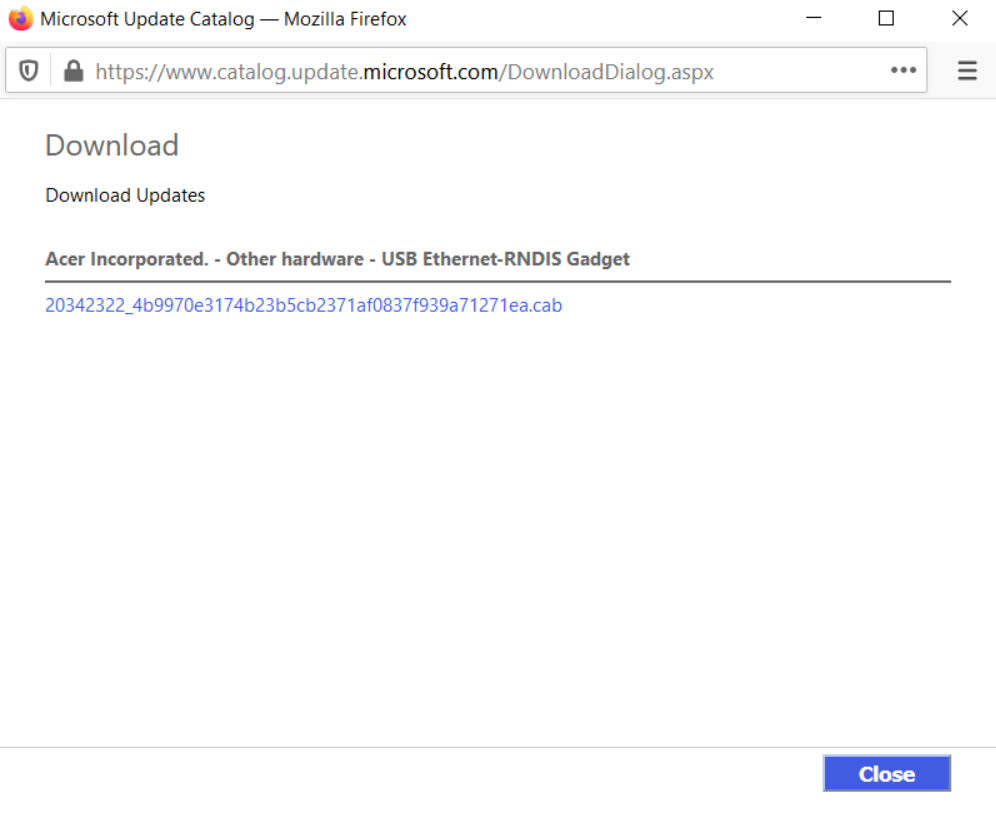
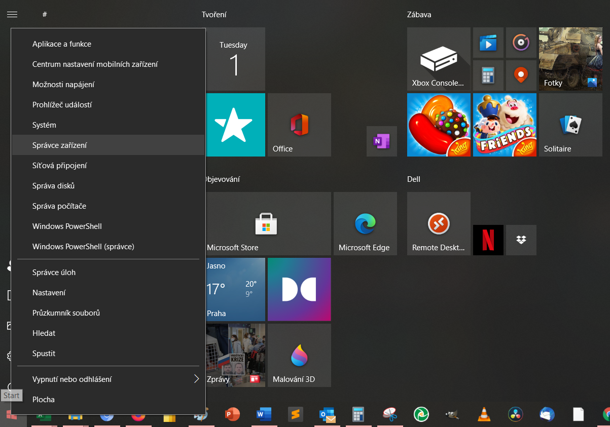
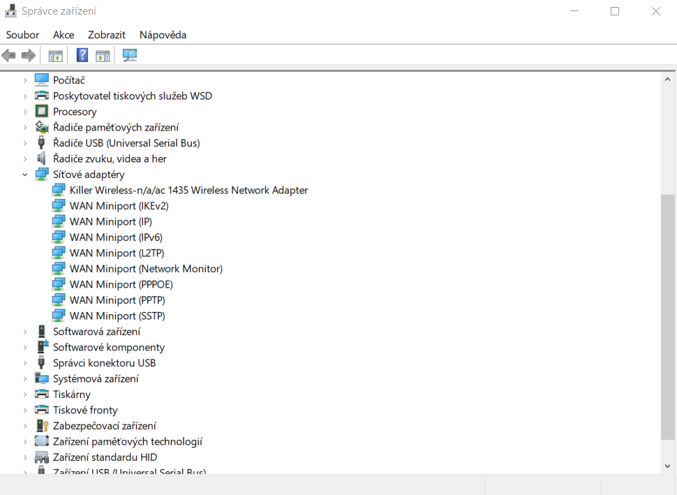
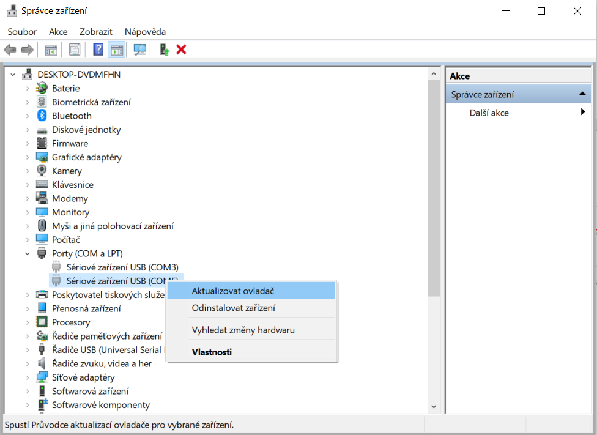
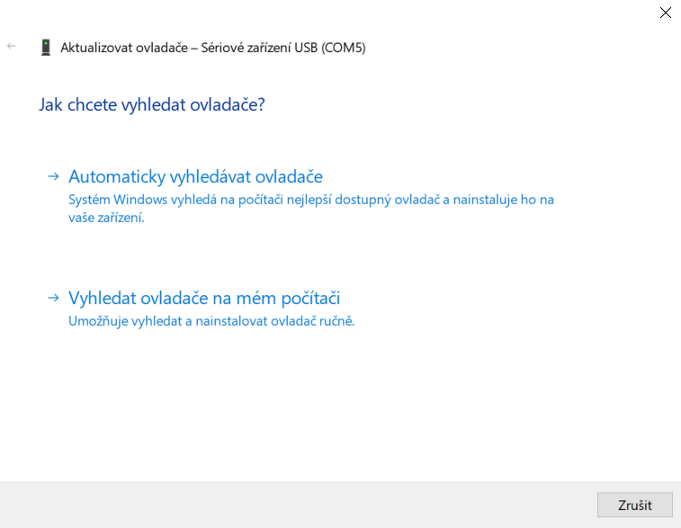
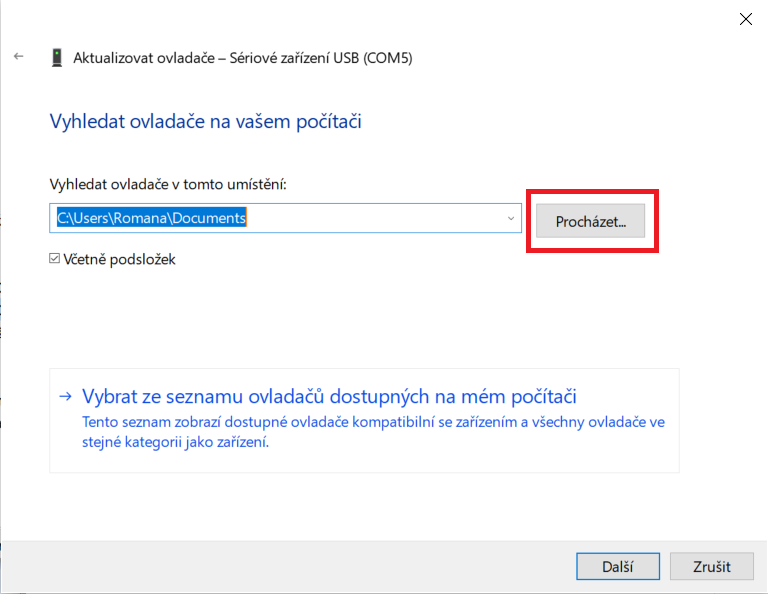
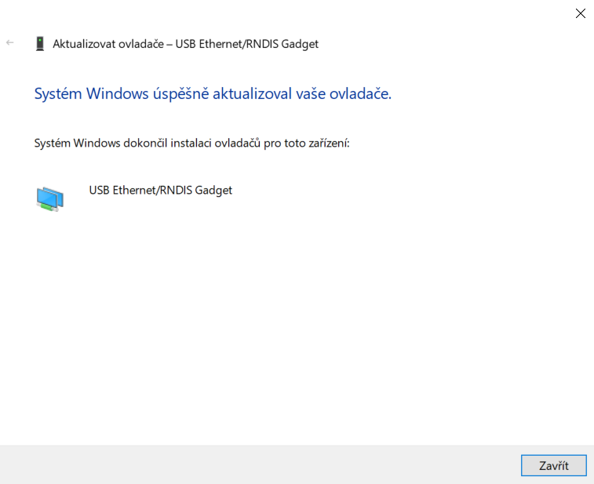
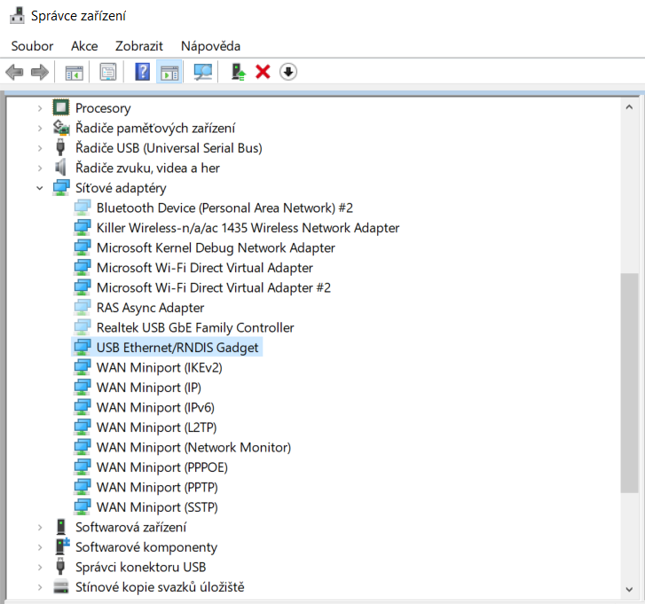

<div style="background: #ea272e; color: #fff; padding: 10px; margin-bottom: 50px; font-size: 20px; text-align: center;">
    Tato stránka již není aktualizována. Prosím navštivte aktuální stránky dokumentace:
    <div style="margin: 20px 0 20px 0;">
        <a href="https://karmen.tech/docs/" style="font-weight: bold; color: #fff;">https://karmen.tech/docs/</a>
    </div>
</div>

# Úvodní zapojení Karmen Pill na zařízení s Windows

Pokud používáte zařízení s operačním systémem Windows, bude třeba nejprve stáhnout ovladač, který v tomto operačním systému chybí.

## Spojení Pillu s počítačem

Nejprve připojte Pill k počítači dodaným USB kabelem. Pozor, pokud využijete vlastní kabel, dbejte na to, aby umužňoval přenášet data a nebyl pouze nabíjecí.
Počkejte až se Pill modře rozsvítí a následně zhasne.
Potom přejděte na URL pro [stažení ovladače](https://www.catalog.update.microsoft.com/Search.aspx?q=usb%20vid_0525%20pid_a4a2).

<borderedImage></borderedImage>

Zobrazí se stránka pro stažení ovladače. Ovladač stáhněte a dobře si zapamatujte místo, kam jej ukládáte.

!> Někteří uživatelé mají problém, že se jim nedaří stáhnout ovladač ze serverů Microsoft. Z tohoto důvodu nabízíme možnost [stažení ovladače od nás](_media/usb-windows-driver-20342322_4b9970e3174b23b5cb2371af0837f939a71271ea.cab ':ignore').

<borderedImage></borderedImage>

## Instalace ovladače

Pravým tlačítkem klikněte na Start a vyberte ```Správce zařízení```


<borderedImage></borderedImage>

Pod možností ```Síťové adaptéry``` se podívejte, zda vidíte "USB Ethernet/RNDIS Gadget". To je ovladač, který je třeba nainstalovat.

<borderedImage></borderedImage>

Nyní rozklinete ```PORTY (COM A LPT)```, kliknete pravým tlačítkem na ```Sériové zařízení USB``` a zvolte Aktualizovat ovladač.

<borderedImage></borderedImage>


!> Nevidíte PORTY (COM A LPT)? [Podívejte se sem](porty.md).


Dále z nabízených možností zvolte ```Vyhledat ovladače na mém počítači``` a

<borderedImage></borderedImage>

pomocí tlačítka ```Procházet``` najděte složku, kam jste stažený ovladač uložili (předtím jej bude potřeba nejspíše rozbalit).


<borderedImage></borderedImage>

<borderedImage></borderedImage>

Nyní Pill odpojte, znovu připojte a měli byste jej vidět jako ```USB Ethernet/RNDIS Gadget``` v ```Síťových adaptérech```.

<borderedImage></borderedImage>
