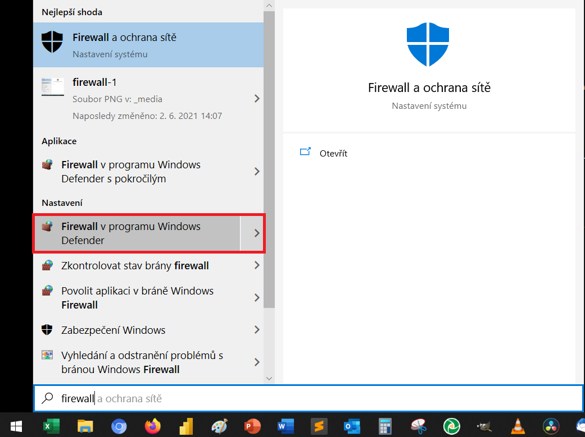
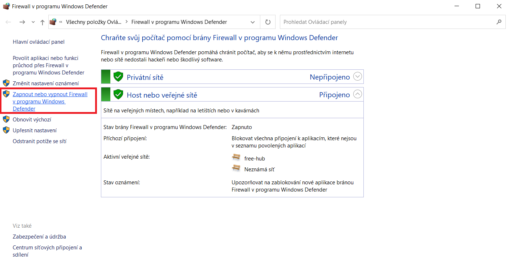
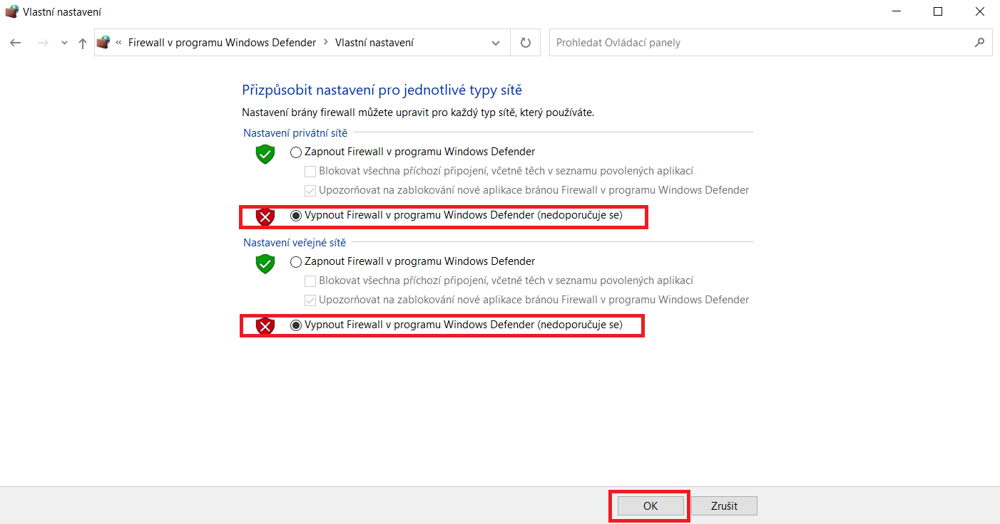

Jestli se Vám stránka  [pill.karmen.tech](http://pill.karmen.tech/) nenačítá, je možné, že Vám firewall brání v používání Pillu. Zkuste ho proto dočasně vypnout podle návodu níže. 

## Dočasné vypnutí Firewall

Začněte tím, že si otevřete Windows Defender Firewall. 

<borderedImage></borderedImage>

Nyní Firewall vypněte pomocí nastavení vlevo.

<borderedImage></borderedImage>

<borderedImage></borderedImage>

Teď Karmen Pill odpojte od počítače, znovu ho připojte a nyní by měla stránka [pill.karmen.tech](http://pill.karmen.tech/) fungovat správně. Nezapomeňte po dokončení nastavení Firewall znovu zapnout.  