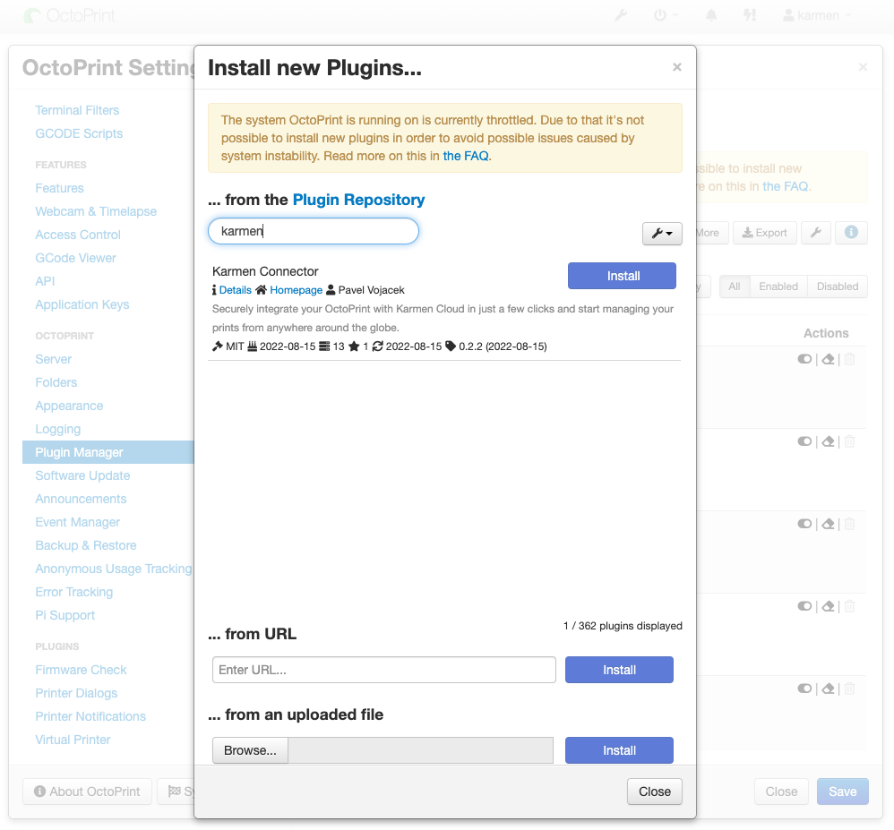
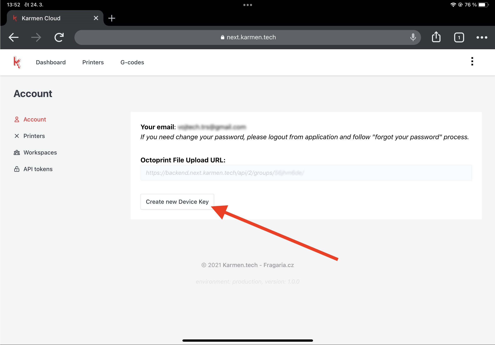
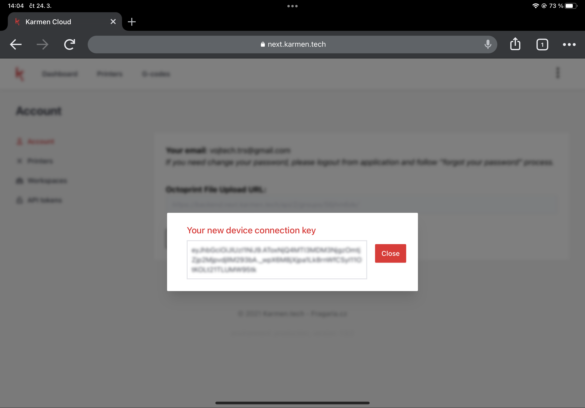

# Karmen Connector - Octoprint Plugin

## Requirements
- device with Octoprint
- account on [next.karmen.tech](https://next.karmen.tech)

## Step by step setup
### Instalation of Karmen Connector plugin
Log into your octoprint like **admin** user.  
Go to Settings => Plugin Manager and choose "**GET MORE**"  

Search Karmen Connector plugin and instal  

!> Now you would be asked for rebooting your device to apply changes. Let's do it!

### Creating Karmen device key
Go to Setting => Account look for button "**Create new Device Key**"

After pressing button you will get an unique device key.  
Highly recommend to keep this window open. Key will be used at **plugin & adding new printer**.

## Fill key to plugin
Go to Settings => Karmen Connector plugin, fill `Device key` and save settings.

### Creating Octoprint secondary API key
!> We don't recommend using Octoprint master API key. Please for Karmen Connertor create separate API key.

Go to Setting => Application keys  
There you could name secondary key and create.  
We chose `karmenCLOUD` to easy find his purpouse in future.

### Adding printer to your Karmen workspace
Open Setting => Printers => Add Printer button.  
Now fill information like example below.  

`Printer name` is your name of printer  
`Octoprint API Key` is secondary API we generated in Octoprint  
`Device key` is key generated to fill into plugin  

# Contacts & support
We’ll gladly answer all your questions or comments. Please get in touch at karmen@karmen.tech. Thank you for your interest and support!

