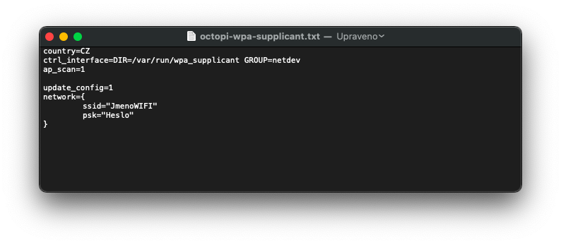
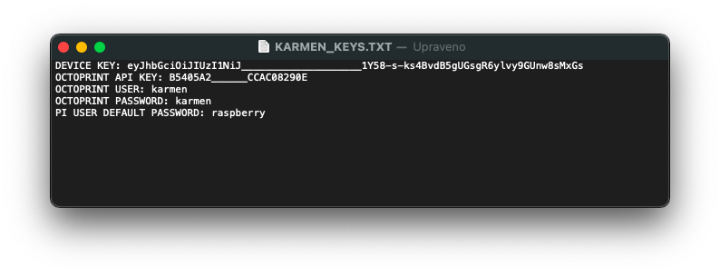
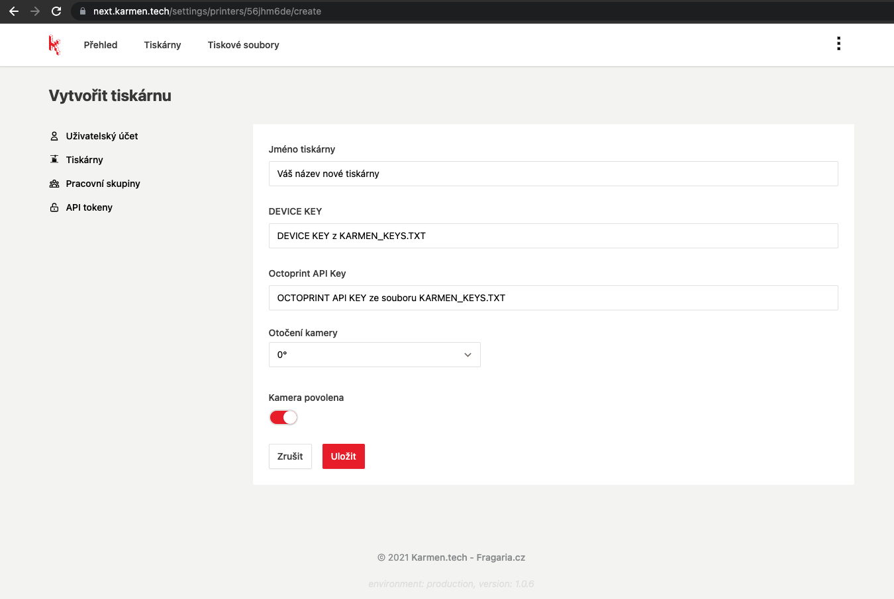

# Karmen Pill v2 a Karmen Pill XL - nastavení

!> Ujistěte se, jakou verzi Karmen Pillu máte. Tento návod je určen pro konfiguraci Pillu přes SD kartu.

### Prvotní nastavení a připojení
Pro prvotní nastavení vyjměte paměťovou kartu z Karmen Pillu a zapojte do počítače.

?> Tip: Součástí balení je adaptér čtečky "Micro SD">"SD" karet.

## Nastavení WiFi
- na SD kartě najdete soubor `OCTOPI-WPA-SUPPLICANT.TXT`
- pro otevření použijte výchozí editor textoru bez formátování
- v souboru nahraďte hodnoty **JmenoWIFI** a **Heslo** jménem vaší wifi (SSID) a heslo pro připojení.  

- po změne uložte a zavřete soubor

!> Při zadávání dbejte na **VELKÁ** a **malá** písmena.

## Připojení Pillu do Karmen Cloud
- na SD kartě najdete soubor `KARMEN_KEYS.TXT`
- z otevřeného souboru budete potřebovat hodnoty `DEVICE KEY` a `OCTOPRINT API KEY`

!> **Karmen Key s nikým nesdílejte**. Je to unikátní kód, kterým se zařízení identifikuje na serveru.

?> Svou tiskárnu můžete nasdílet s dalšími uživateli později v pracovní skupině na Karmen Cloudu.

- soubor nechte otevřený a přihlašte se ve vašem prohlížeči na [Karmen Cloud](next.karmen.tech)
- dále přejdete **Nastavení => Tiskárny => Přidat tiskárnu** nebo jednoduše přes odkaz https://next.karmen.tech/settings/printers a zde vyplňte hodnoty dle vzoru níže

### Zadání hodnot nové tiskárny
`Jméno tiskárny`: zadejte "libovolný" název pro tiskárnu, například "moje tiskárna :-)"  
`DEVICE KEY`: zkopírujte hodnotu `DEVICE KEY` z `KARMEN_KEYS.TXT`  
`Octoprint API Key`: zkopírujte hodnotu `OCTOPRINT API KEY` z `KARMEN_KEYS.TXT`  
a klikněte na **uložit**.

  

Gratulujeme, nyní máte připojenou tiskárnu do Karmen a můžete na ní přistupovat odkukoliv.

### Kontakt a podpora

Kdyby cokoliv nevyšlo, ozvěte se na karmen@karmen.tech a s problémem Vám pomůžeme :)
