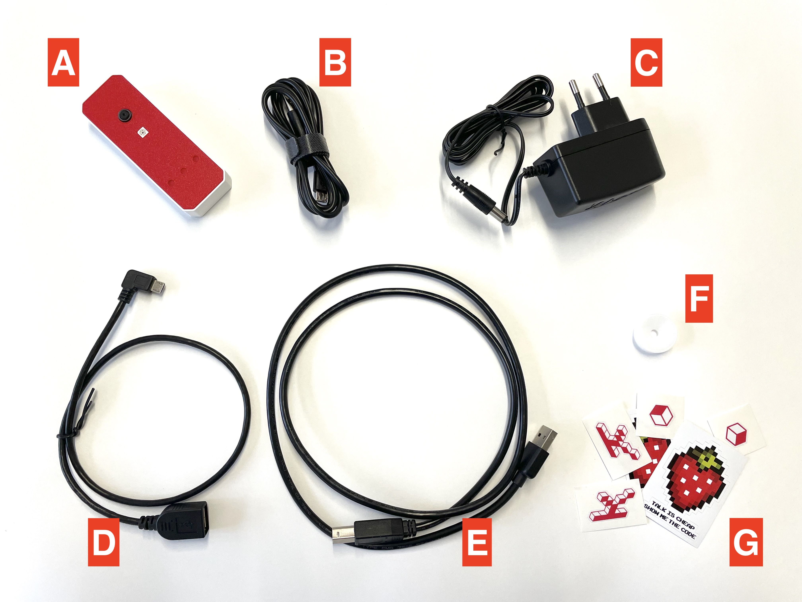
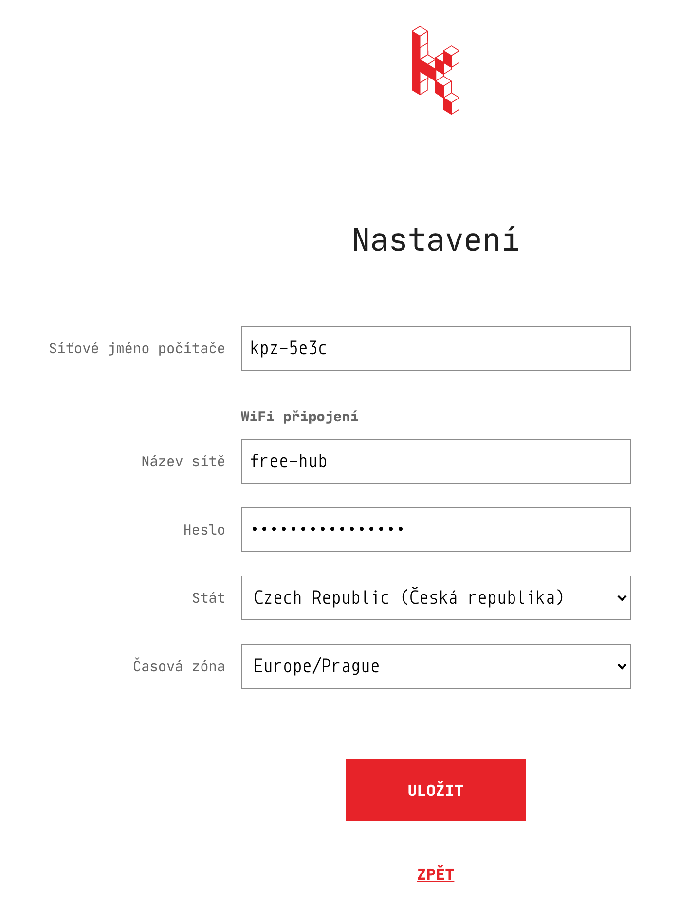
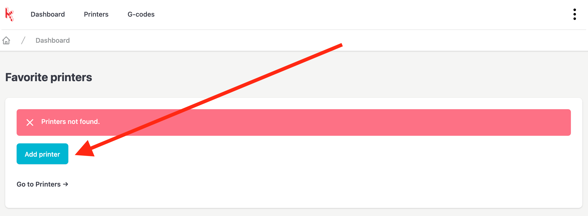
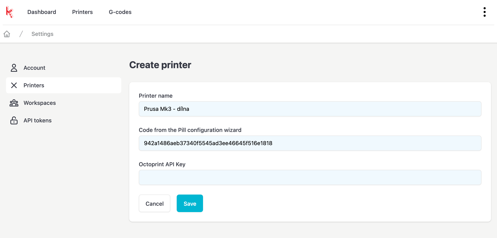
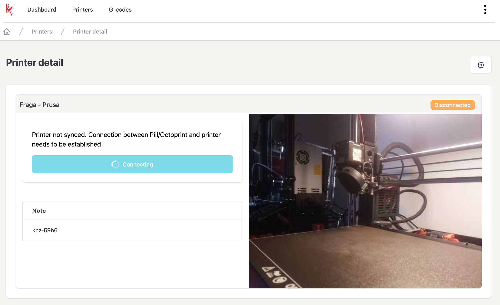
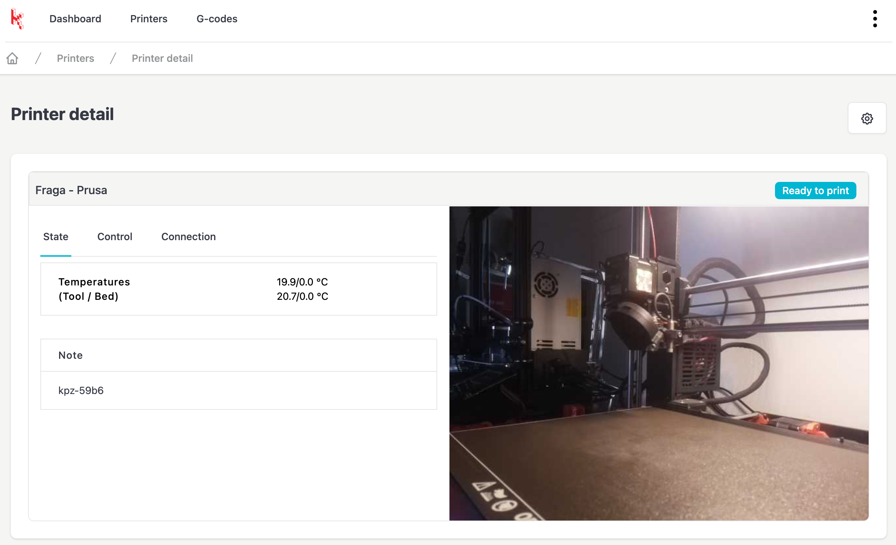

# Karmen Pill - začínáme

## Obsah balení

- **A**: Krabička Karmen Pill
- **B**: Propojovací USB kabel pro připojení Karmen Pill s počítačem a úvodní nastavení wifi
- **C**: Napájecí adaptér
- **D+E**: Kabely k propojení Karmen Pill a 3D tiskárny
- **F**: Ostřící kolečko na kameru
- **G**: Pár našich samolepek :-)

<borderedImage></borderedImage>

## Připojení Pillu k Wifi

Připojte Karmen Pill **(A)** k Vašemu počítači pomocí USB kabelu **(B)**. V tuto chvíli není potřeba, aby byl do Pillu připojen napájecí adaptér - napájení zajistí USB z počítače.

!> Pozor, pokud využijete vlastní kabel, dbejte na to, aby umožňoval přenášet data a nebyl pouze nabíjecí.

Pill začne po připojení k počítači modře blikat (cca 30 vteřin po připojení). V tuto chvíli otevřete v internetovém prohlížeči adresu http://169.254.13.1/.

!> Microsoft Windows: Stránka http://169.254.13.1/ se Vám stále nenačítá? Nejspíš budete muset dočasně [vypnout firewall](firewall.md).

V konfiguračním průvodci zvolte "nastavení wifi", kde vyplňte údaje o Vašem wifi připojení. Po uložení se Vám zobrazí kód zařízení, který si zkopírujte - budete jej potřebovat pro přidání tiskárny.

<borderedImage></borderedImage>

!> Pill je možné připojit pouze na wifi 2.4GHz - 5GHz wifi není podporována.

## Přidání Pillu do Karmen Cloudu

### Začněte tím, že připojíte Pill k tiskárně

- zapojte napájecí adaptér **(C)** do zásuvky a druhý konec do Pillu
- propojte Pill s tiskárnou pomocí kabelů **D** a **E**

### Přidejte Pill do Cloudu

?> Tento krok předpokládá, že již máte účet v Karmen Cloudu. Pokud ho nemáte, můžete si ho jednoduše [vytvořit](https://next.karmen.tech/registration/).

Pokud ještě nemáte žádnou tiskárnu, tak po přihlášení uvidíte tlačítko pro přidání tiskárny. Další tiskárny můžete přidávat nebo upravovat v [nastavení](https://next.karmen.tech/settings/printers).

<borderedImage></borderedImage>

Do formuláře přidání tiskárny vyplňte název tiskárny a kód zařízení (Pillu), který jste si zkopírovali v předchozím kroku, ve kterém jste nastavovali wifi připojení.

!> Pokud jste si kód zařízení/Pillu nezkopírovali, tak si ho můžete zobrazit opětovným připojením Pillu k počítači a na stejné adrese, jako jste [nastavovali wifi připojení](karmen-pill-zaciname?id=připojení-pillu-k-wifi), tak uvidíte i kód Pillu.

<borderedImage></borderedImage>

## Spojení Pillu s tiskárnou

Pokud se Vám podařili všechny předchozí kroky, tak v tuto chvíli máte:

- nastavenou wifi v Pillu - tj. Pill je bezpečně připojen do internetu
- máte vytvořen účet v Karmen Cloudu
- do Karmen Cloudu jste si přidali Pill dle jeho kódu

Na [úvodní stránce](https://next.karmen.tech/) Karmen Cloudu byste měli vidět nově přidanou tiskárnu. Kliknutím přejděte na detail tiskárny. Pokud je Pill online (je zapnutý a připojený k internetu), tak uvidíte obraz z kamery. Vedle obrazu z kamery bude tlačítko "Připojit", na které klikněte, čímž dojde k navázání datové komunikace mezi Pillem a tiskárnou.

<borderedImage></borderedImage>

Ve chvíli, kdy je navázána komunikace mezi Pillem a tiskánou, zobrazí se Vám základní informace o tiskárně a další možnosti jejího ovládání.

<borderedImage></borderedImage>

Nyní můžete tiskárnu začít používat. V menu aplikace klikněte na "tiskové soubory" (Gcodes), kde můžete přidat soubory do tiskové fronty. Případně [koukněte na návod](prusaslicer-gcode-upload), jak je možné posílat tiskové soubory do Karmen přímo z PrusaSliceru.

## Kontakt a podpora

Kdyby cokoliv nevyšlo, ozvěte se na karmen@karmen.tech a s problémem Vám pomůžeme :)
