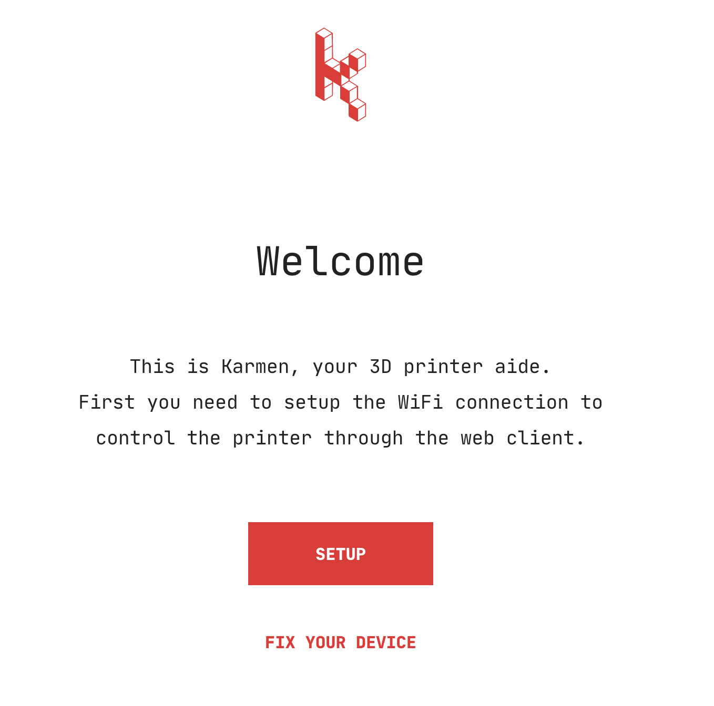
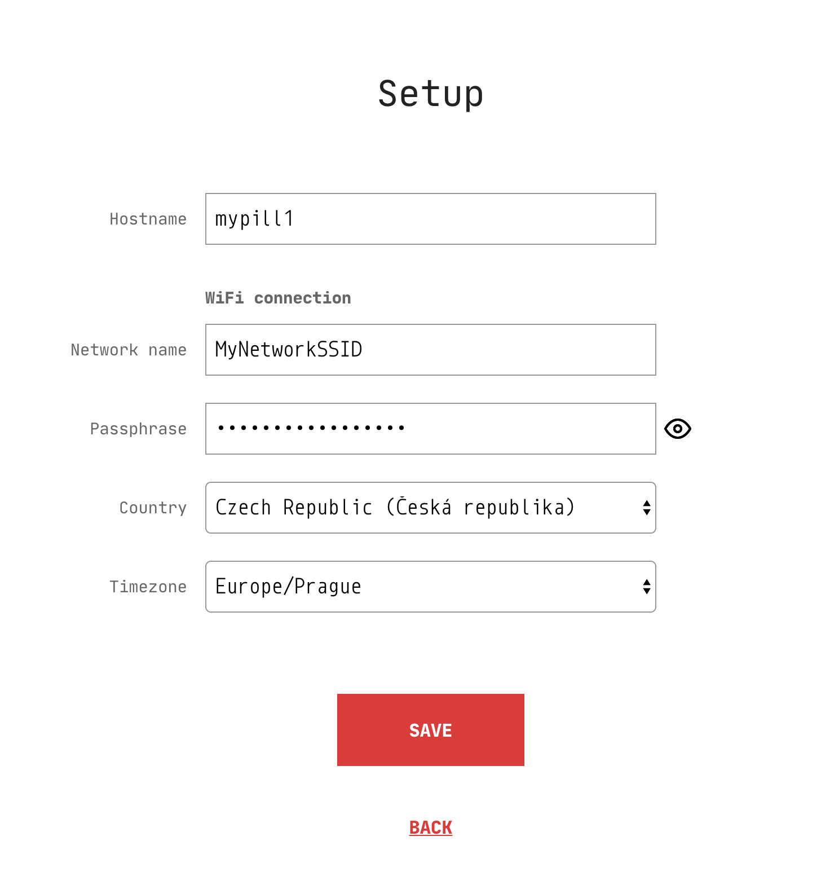
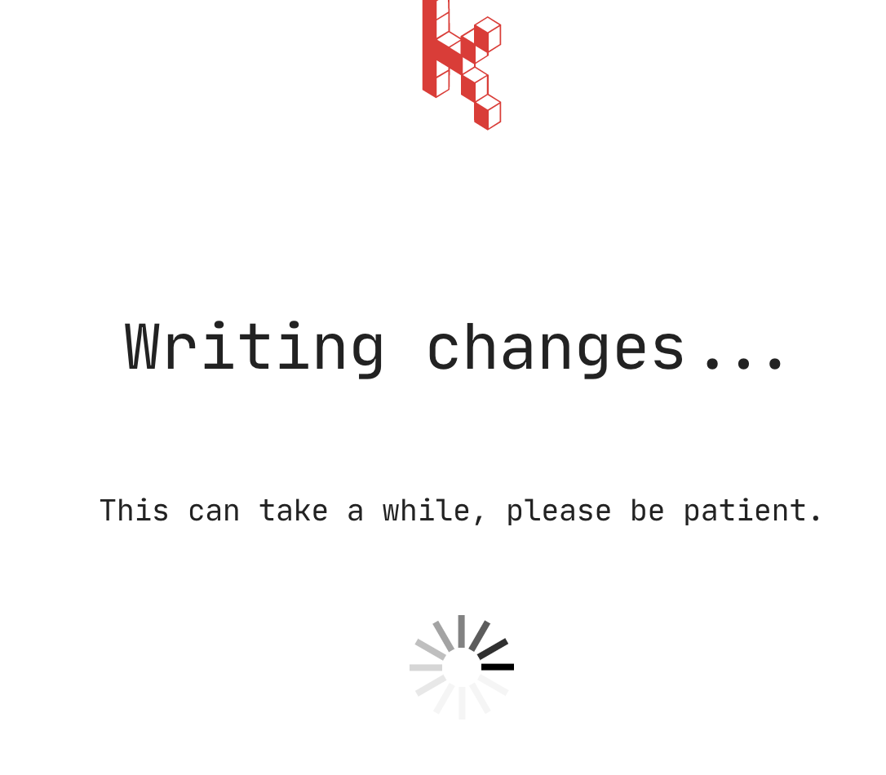
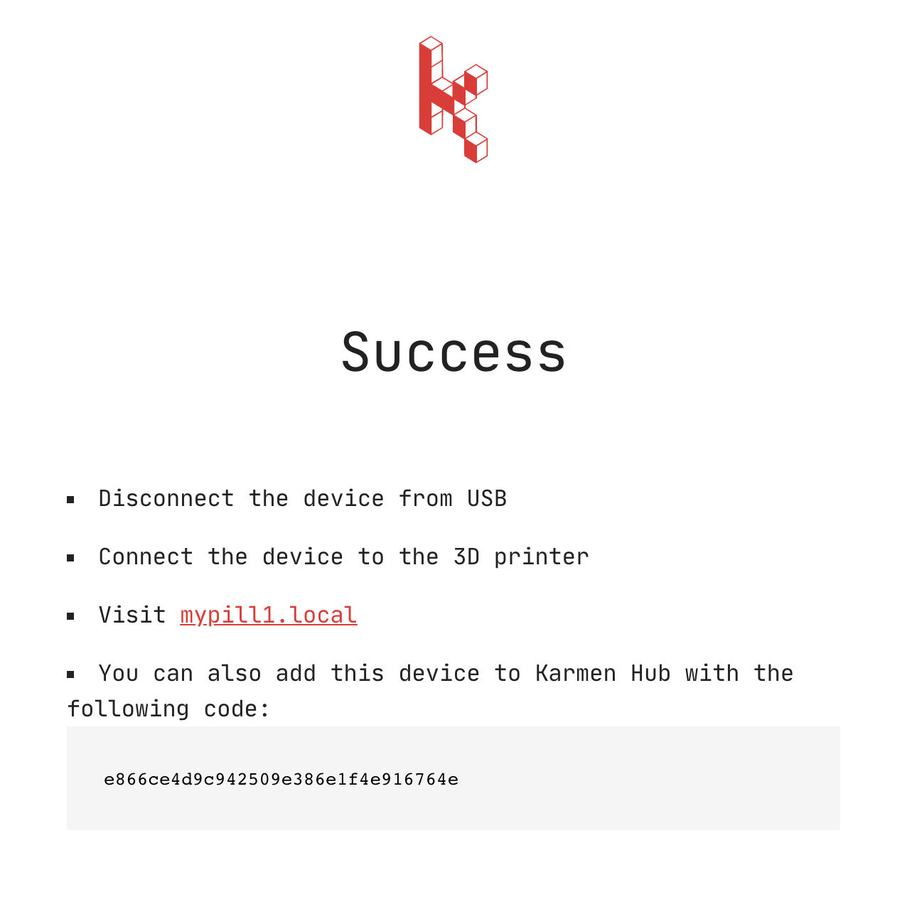
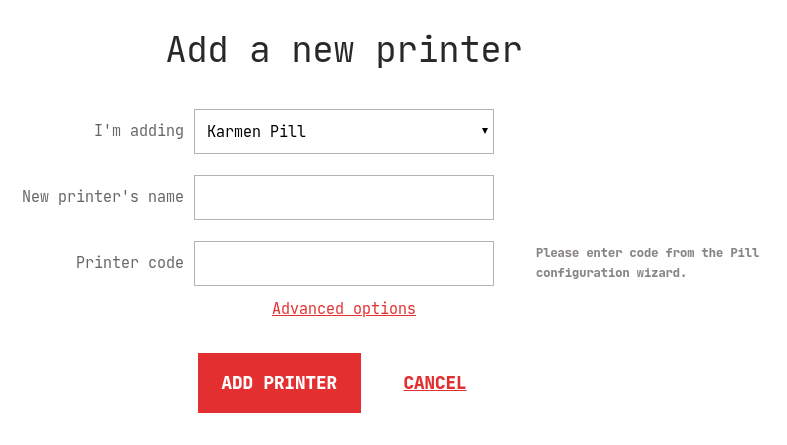

# Getting started with Karmen Pill

This tutorial will guide you through the first launch of your new Karmen Pill
box. We will cover whole setup from the [initial
config](old/pill-getting-started.md?id=initial-configuration) all the way down to
[linking Pill with Karmen](old/pill-getting-started.md?id=linking-with-karmen). Once
finished, you should have fully working Karmen bundle and be able to manage your
printer remotely.

## Package contents

In your Pill package, you will find following items:

- **Karmen Pill** controller (obviously)
- **Power adapter** for the region you've selected during order
- An **USB - microUSB** cable for connecting your Pill to your computer during [initial configuration](old/pill-getting-started.md?id=initial-configuration)
- An **USB type B - microUSB + USB** cable for both connecting your Pill to your printer and powering it at the same time
- An **USB extension cord** when your power socket is further away

## Initial configuration

After you've unpacked your Pill, it's time to do the initial configuration.
Using the **provided USB cable** (microUSB - USB one), connect your Pill box to
your computer. This cable also serves as the power source so you won't need the
power adapter just yet. Allow few minutes for Pill to boot up. After couple
seconds, Pill LED light will signalise it's starting up with a blinking blue light. When
the LED turns off, your Pill has booted succesfully and shall be available at
[pill.karmen.tech](http://pill.karmen.tech). Open up your browser and you
should be greeted with an introduction page:

!> Having trouble on your Windows 10 computer? See [this guide](old/pill-win10.md).

### Setting up the WiFi

Your Pill will ask you to set up the WiFi connection first. Enter your network
connection details (*network name* and the *passphrase*), select an appropriate
Pill hostname (like `mypill1`) and adjust your country and timezone information
if you want. Confirm your input by clicking on the **Save** button.

!> Pill currently **only supports 2.4GHz WiFi**.

Pill will now persist your settings and will try to connect to your WiFi network.

Once WiFi connection is estabilished, your Pill will display a confirmation
screen along with a **token** that you will use to **register it with Karmen cloud**
service. **Write it down** or **keep the browser tab open** for later use.

## Connecting to the printer

When the initial configuration is dealt with, simply unplug your Pill from your computer.

### Mounting

Next, you will need to secure your Pill controller in some nice location.
As you know, Pill features both webcam and a LED lightning. In order for this to
work properly, you will need to mount your Pill to the 3D printer itself or
somewhere near it so that it has a clear view to your printer's bed.

To simplify this, we are continually building up a collection of **ready-made
designs** that can be 3D-printed easily. See the [collection on
Thingiverse](https://www.thingiverse.com/KarmenTech/collections/karmen-pill-holders), pick the design for your
printer brand and print it—we recommend white or red PETG!

!> We kindly ask our community members to **share their customized Pill holder
models with us**. If you have a design that others can benefit from, ping us on
[karmen@karmen.tech](mailto:karmen@karmen.tech) and we will gladly add it to our
official collection. Also, it's a good idea to add the `karmen` and `pill` tags
to your Thingiverse design.

### Connecting

Karmen Pill connects to your printer **using the second provided USB cable**.
This cable might look a bit different from what you're used to. It has *both*
microUSB and regular USB connectors as well as USB type B one. Regular USB goes to
the included power adapter, microUSB goes to the Pill itself and the remaining
USB type B goes to your printer USB port. In case you need longer cable for
connecting the power adapter, you can use the USB extension cord which is also
included in the Pill package. When you have everything hooked up, plug in the
included power adapter to the socket and wait until Pill boots up again. Be
patient, first boot might take as long as 5 minutes. You will know Pill has
booted up once the blue LED light stops blinking.

After a while, your Pill should be accessible with a web browser using the
hostname you've chosen previously with a **.local** suffix, e.g.
`mypill1.local`. When you visit this address, you should see
[OctoPrint](https://octoprint.org/) management interface. No need to do anything
with it, we've just made sure everything worked out A-OK.

!> If you're having trouble accessing your Pill using the hostname, please note we use
[mDNS](https://en.wikipedia.org/wiki/Multicast_DNS) for this. That technology
**might not work** on some clients (namely on Windows) without further
configuration. If this happens, find out your Karmen Pill IP directly using your
router's interface. Look for the DHCP client list, your Pill should be listed
here, too. Use that IP instead of hostname.

## Linking with Karmen

All the hard work is completed and the last remaining step is to register your
Pill box with Karmen cloud service. Navigate to
[cloud.karmen.tech](https://cloud.karmen.tech), log in to your account and locate the Printer
settings page (open the app menu and click on **Settings**). Click on the **Add
a printer** button and then following dialog will be displayed:

Select a nice name for your new printer, enter the token you've been given
previously at the end of [WiFi
setup](old/pill-getting-started.md?id=setting-up-the-wifi) in the *Printer token*
field and hit **Add printer** to confirm it (API key field, hidden under
advanced options, is not required withKarmen Pill).
Assuming that everything went smoothly, you should now see your
new Karmen Pill box under Printers list (*Printers* menu item). **Happy
printing!**

If you didn't have a chance to read through Karmen docs, it is now a good time
to do that to get yourself familiar with Karmen features. The [quickstart
guide](old/quickstart.md) is a good starting point.
