# Fixing Pill box not reachable on Windows 10 {docsify-ignore-all}

On some Windows 10 systems, several users have reported Karmen Pill connection
issues. You might be experiencing one or both of the following:

* **Driver problem**: an inappropriate USB driver might be used for your Pill
  box.
* **Firewall issues**: a firewall rule might be blocking the network connection
  to the Pill box.

This guide will help you fix either of those. Before starting, **connect you
Pill box** with the provided USB cable to your computer and wait until it starts
blinking with a blue light.

## Verifying which driver is used

Open the Device manager and verify that you can see the **USB Ethernet/RNDIS
Gadget** record under **Network adapters**.

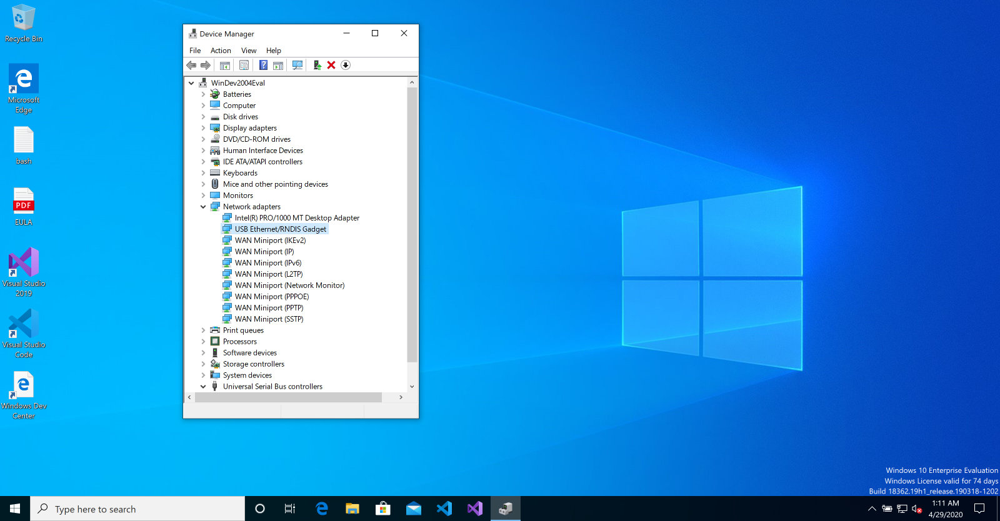

Chances are you see this instead:

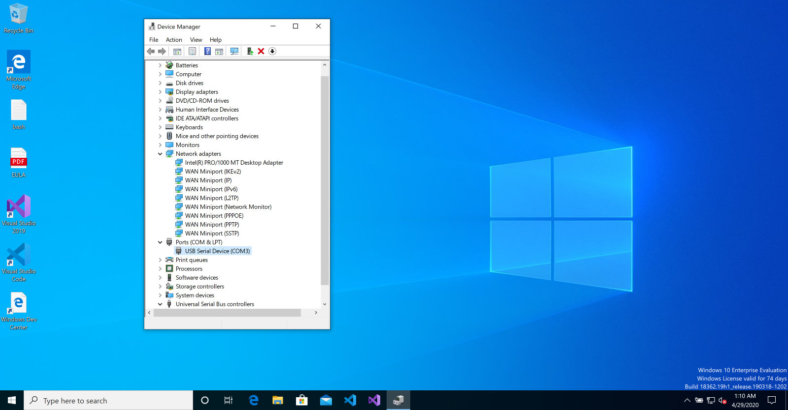

If that's the case, your're on the right track. Windows have chosen an
inappropriate USB driver which we're about to fix.

## Forcing the right driver for the USB device

Still in the **Device manager** window, right-click on the **USB Serial Device**
record under **Ports (COM & LPT)** and select **Update driver** in the context
menu.

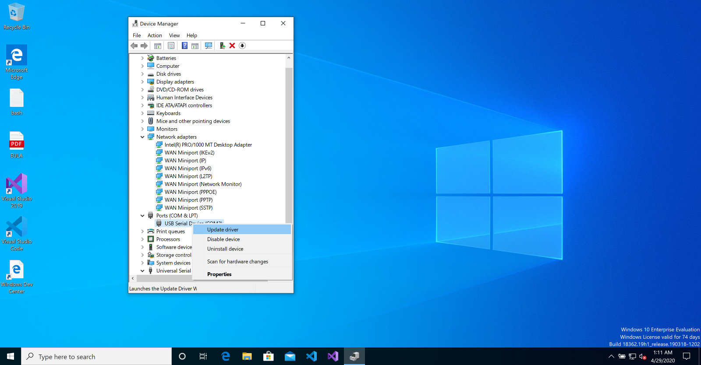

When the driver selection dialog appears, choose the second option named
**Browse my computer for driver software**.

Next, click on **Let me pick from a list of available drivers on my computer**.

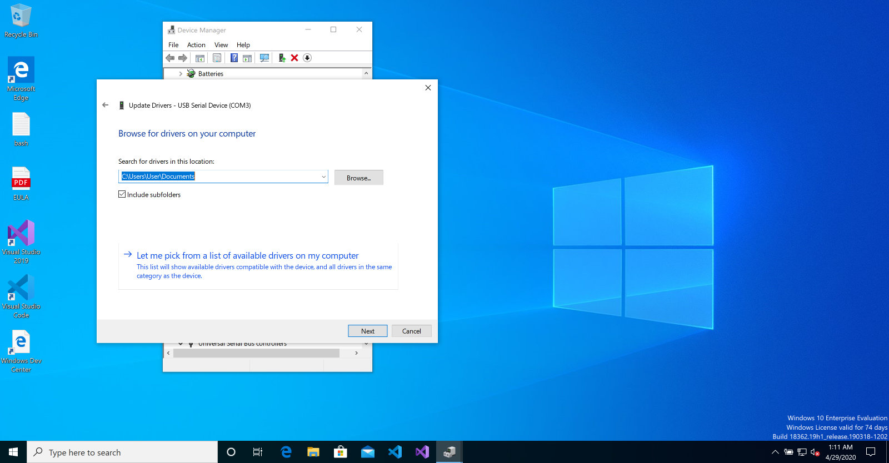

Finally, select **USB Ethernet/RNDIS Gadget** driver and confirm your choice by
clicking on the **Next** button. See the [section
below](old/pill-win10.md?id=dowloading-usb-driver-if-it39s-missing) if you can't see
the driver in the list, you will need to download it first.

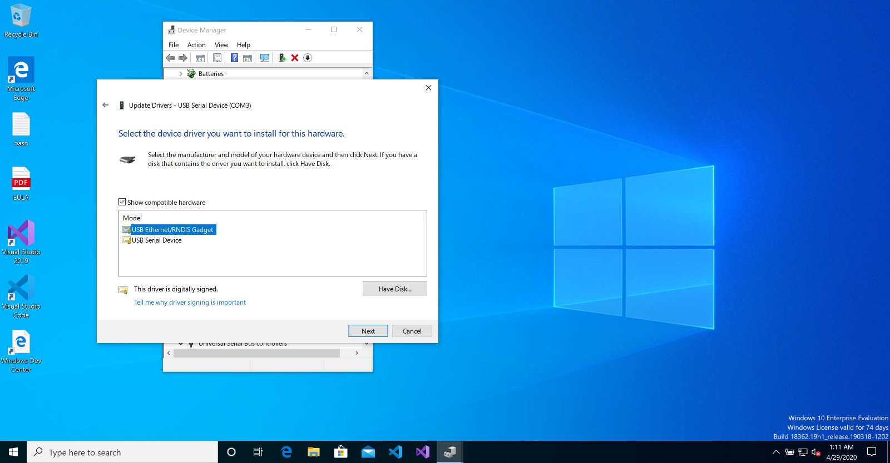

Close the confirmation window, **disconnect Karmen Pill and reconnect it once
again**. Verify your device can be seen as **USB Ethernet/RNDIS Gadget** under
**Network adapters**. Also, it is a good idea to verify your Pill box can be
seen in the **Network Connections** settings:

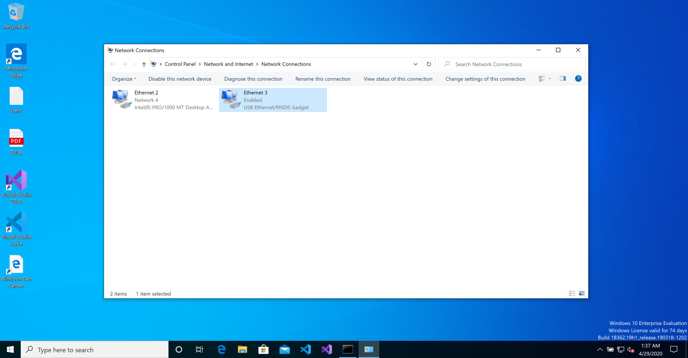

The device might be named differently (*Ethernet 3* in this case). The important
bit is whether it reports **USB Ethernet/RNDIS Gadget** as the network adapter
name.

## Dowloading USB driver if it's missing

If you can't select **USB Ethernet/RNDIS Gadget** driver, it means it's missing
on your machine and you need to download it first. Navigate to [Windows Update
Catalog](https://www.catalog.update.microsoft.com/Search.aspx?q=usb%20vid_0525%20pid_a4a2),
choose an appropriate version according to your OS and download it.

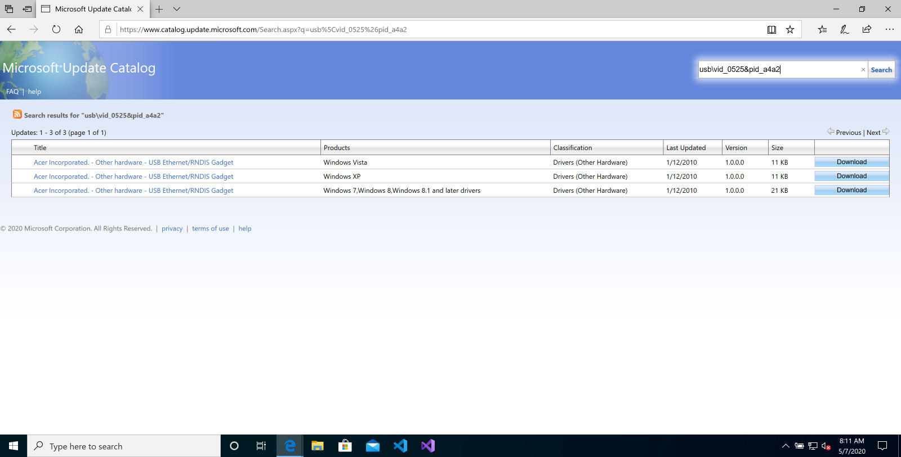

The downloaded file will be a `.cab` archive which you need to extract by double
clicking on it. Two files will be left after extracting it. Then, follow the
guide as described in [previous
section](old/pill-win10.md?id=forcing-the-right-driver-for-the-usb-device) but
select **Have disk...** option on the driver selection page instead of selecting
the driver from the option list.

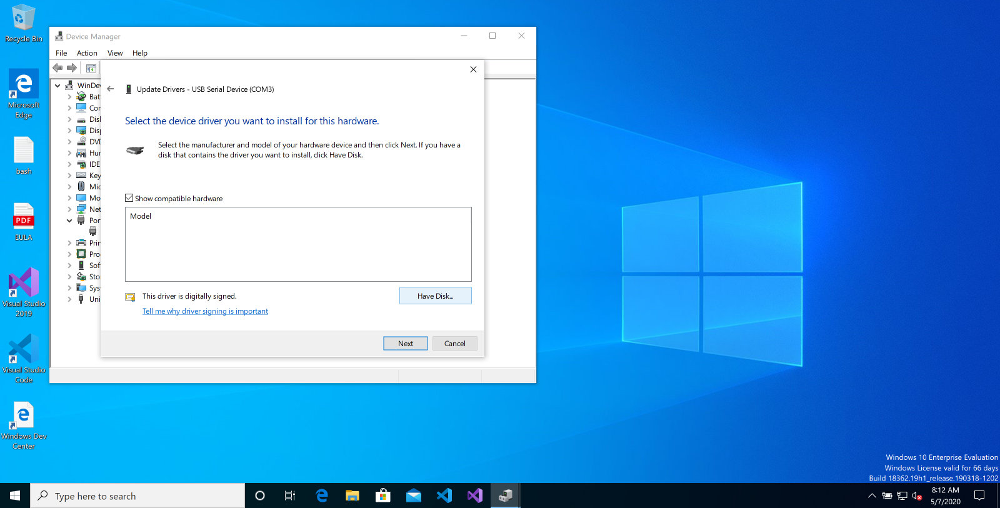

You will be asked to select directory with the driver. Use the file browser to
navigate to the directory where you've extracted the driver archive previously
and select the **RNDIS** file.

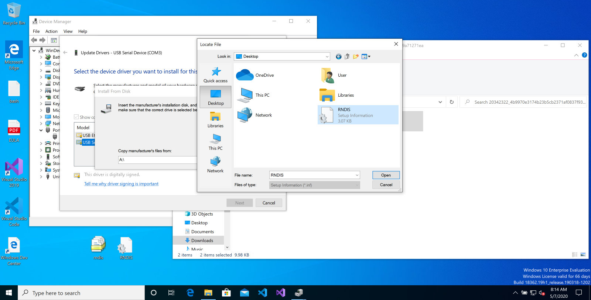

Rest of the installation **stays the same**. Continue with the driver installation
as described above.

## Bypassing the Windows firewall temporarily

Some connection problems might be hapenning due to Windows 10 firewall
**blocking the network connection** to your Pill. Since we just need to run
through the Karmen Pill initial configuration wizard, the easiest option to work
around this is to simply disable the Windows firewall temporarily for a couple
minutes and re-enable it again once we're finished.

Start by opening the **Windows Defender Firewall** settings.

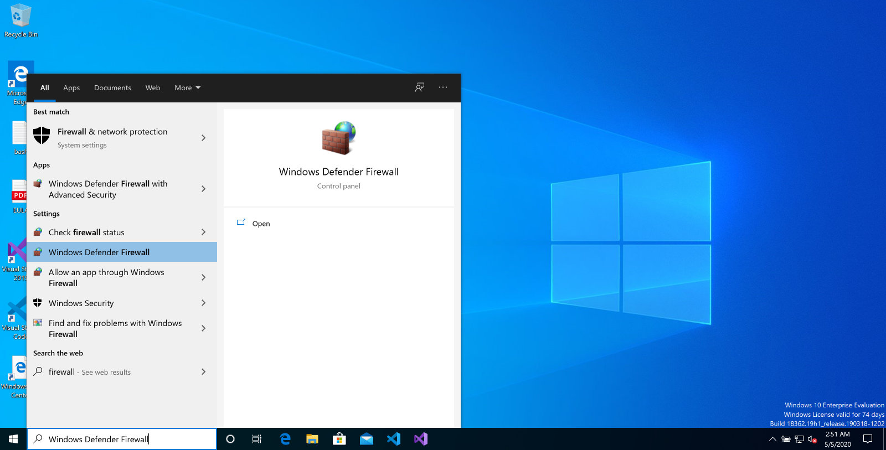

Now **turn the firewall off** using the menu item on the left of the firewall
window.

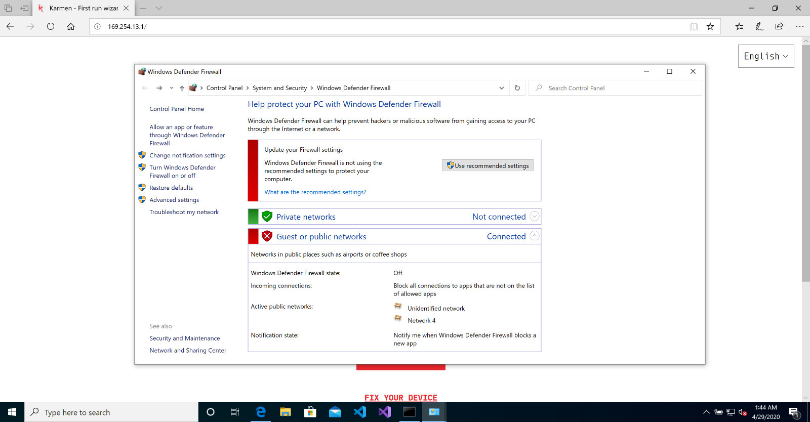

Finally, **disconnect your Karmen Pill and reconnect it again**. It should now be accessible either at
[pill.karmen.tech](http://pill.karmen.tech) or at
[169.254.13.1](http://169.254.13.1). Configure your Karmen Pill [the usual
way](old/pill-getting-started.md?id=initial-configuration) and once you complete the
configuration wizard, **turn the firewall on again**.

