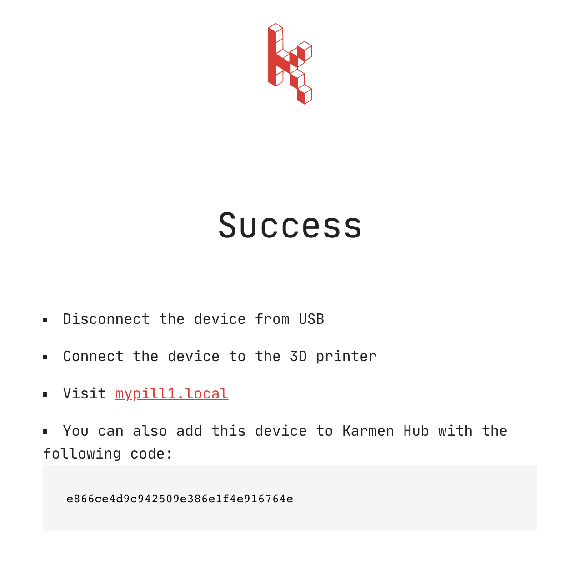

# Getting started with Karmen Pill

This tutorial will guide you through the first launch of your new Karmen Pill
box. We will cover whole setup from the [initial
config](pill-getting-started.md?id=initial-configuration) to the 3D printer all
the way down to [linking Pill with
Karmen](pill-getting-started.md?id=linking-with-karmen).

Once finished, you should have fully working Karmen bundle and be able to manage your
printer remotely.

## Initial configuration

After you've unpacked your Pill, it's time to do the initial configuration.
Using the **provided USB cable** (microUSB - USB one), connect your Pill box to
your computer. Plug in the included power adapter to the socket and Pill will
start up automatically. Allow few minutes for it to boot up.

Once it boots, it will be available on [169.254.13.1](http://169.254.13.1) local
IP. Open up your browser and you should be greeted with an introduction page:

### Setting up the WiFi

Your Pill will ask you to set up the WiFi connection first. Enter your network
connection details (*network name* and the *passphrase*), select an appropriate
Pill hostname (like `mypill1`) and adjust your country and timezone information
if you want. Confirm your input by clicking on the **Save** button.

Pill will now persist your settings and will try to connect to your WiFi network.

Once WiFi connection is estabilished, your Pill will display a confirmation
screen along with a **token** that you will use to **register it with Karmen cloud**
service. Write it down.

## Connecting to the printer

When the initial configuration is dealt with, unplug your Pill from the power
socket and remove the USB cable from your computer.

### Mounting

Next, you will need to secure your Pill controller in some nice location.
As you know, Pill features both webcam and a LED lightning. In order for this to
work properly, you will need to mount your Pill to the 3D printer itself or
somewhere near it so that it has a clear view to your printer's bed.

One nice solution is attaching the Pill using a 3D-printed plastic mount
**directly to the printer heatbed**. If you're an happy owner of Prusa MK3, we already
have a [mount ready for you on
Thingiverse](https://www.thingiverse.com/thing:4267454). Just go ahead, grab it
and print it (we recommend white or red PETG!). Once you have it finished, you
should be able to mount Karmen Pill to the edge below the heatbed so that your
Pill will move back and forth whenever the heatbed moves. We think this is the
best location possible since it allows for a nice view: distance from Pill camera
to extruder is quite similar most of the time.

!> We kindly ask our community members to **share their customized Pill holder models with us**. We
will gladly mention them right here on this docs site.

### Connecting

Karmen Pill connects to your printer **using the provided USB cable** (the
second one, USB type B). Just stick it in and you should be good to go. Finally,
plug in the included power adapter to the socket again and wait until it boots
up.

After a while, your Pill should be accessible with a web browser using the
hostname you've chosen previously with a **.local** suffix, e.g.
`mypill1.local`. When you visit this address, you should see
[OctoPrint](https://octoprint.org/) management interface. No need to do anything
with it, we've just made sure everything worked out A-OK.

!> If you're having trouble accessing your Pill using the hostname, please note we use
[mDNS](https://en.wikipedia.org/wiki/Multicast_DNS) for this. That technology
**might not work** on some clients (namely on Windows) without further
configuration. If this happens, find out your Karmen Pill IP directly using your
router's interface. Look for the DHCP client list, your Pill should be listed
here, too. Use that IP instead of hostname.

## Linking with Karmen

All the hard work is completed and the last remaining step is to register your
Pill box with Karmen cloud service. Navigate to
[cloud.karmen.tech](https://cloud.karmen.tech), log in to your account and locate the Printer
settings page (open the app menu and click on **Settings**). Click on the **Add
a printer** button and then following dialog will be displayed:

Select a nice name for your new printer, enter the token you've been given
previously at the end of [WiFi
setup](pill-getting-started.md?id=setting-up-the-wifi) in the *Printer token*
field and hit **Add printer** to confirm it (API key field is not required with
Karmen Pill). Assuming that everything went smoothly, you should now see your
new Karmen Pill box under Printers list (*Printers* menu item). **Happy
printing!**
