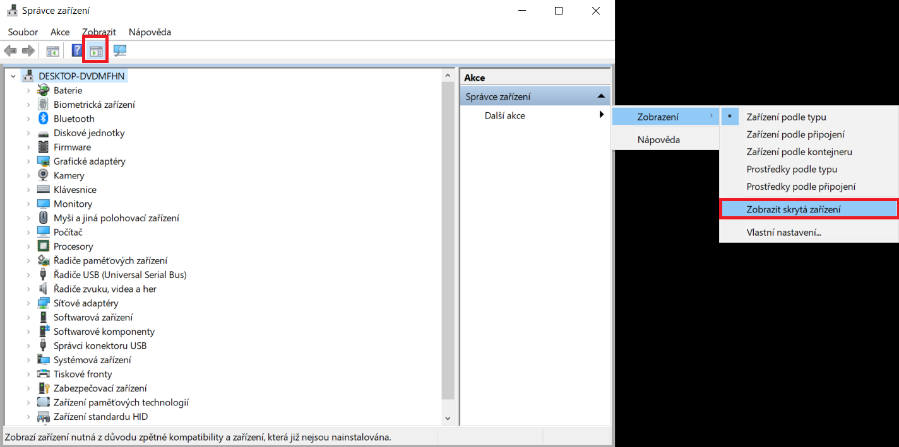

# Nastavení Portu COM a LPT

Pokud byste možnost ```PORTY (COM A LPT)``` neviděli, ujistěte se, že používáte kabel pro přenos dat (ne jen pro nabíjení). Můžete také kliknout na ```Zobrazit/skrýt seznam akcí``` nahoře v menu, kliknout na ```Další akce```, ```Zobrazení``` a ```Zobrazit skrytá zařízení```. Až se Vám porty objeví, dáte aktualizovat.

<borderedImage></borderedImage>