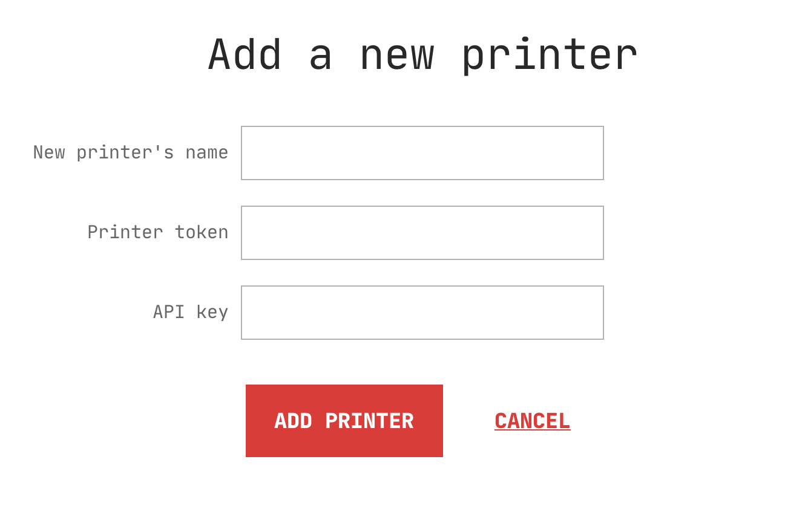

# Managing printers

Each Karmen [organization](access.md?id=managing-organizations) has its own
fleet of 3d printers assigned. Individual 3d printers can be controller using any
supported [printer connection method](connecting-your-devices.md). Karmen serves
as a central printer management hub integrating all the connected devices into
single user interface.

## Displaying printer list

## Displaying printer status

## Editing printer details

## Adding new printers

New printers are added in the organization settings. Locate the Printer
settings page (open the app menu and click on **Settings**) and click on the **Add
a printer** button. Following dialog will be then displayed:

If you are using Karmen in [cloud mode](on-premise.md?id=configuration) or our
hosted Karmen option, only [Karmen Pill devices are
supported](connecting-your-devices.md?id=connecting-octoprint-enabled-devices)
at the moment. If you run Karmen [on-premise](on-premise.md) and have the cloud
mode disabled, you will be able to connect [OctoPrint
boxes](connecting-your-devices.md?id=connecting-octoprint-enabled-devices), too.

### Adding Karmen Pill

### Adding OctoPrint devices

Once you have you OctoPrint box ready and available, you can add it on the Settings page. Navigate to the Settings
using the menu toggle and then click on **Add a printer** button.

You will be asked to enter you OctoPrint instance address. Make sure you enter
the IP address mentioned above. After submitting the form, your OctoPrint
instance setup is finished. In case your OctoPrint is password-protected (which
is always a good idea!), see the next section.

### Octoprint instances with Access Control

In case your instance have [Access
Control](http://docs.octoprint.org/en/master/features/accesscontrol.html#sec-features-access-control)
enabled, you will need to provide Karmen with an API key to use in order to
[authorize
Karmen](http://docs.octoprint.org/en/master/api/general.html#authorization)
requests with your OctoPrint instance. API key can be obtained using the Application Keys Plugin as mentioned
in the [OctoPrint docs](http://docs.octoprint.org/en/master/bundledplugins/appkeys.html#sec-bundledplugins-appkeys).

Once you have your token ready, set it in the Karmen printer settings menu.

!> Option to set the API key will only be displayed, if the OctoPrint is actually password-protected.

## Deleting printers
