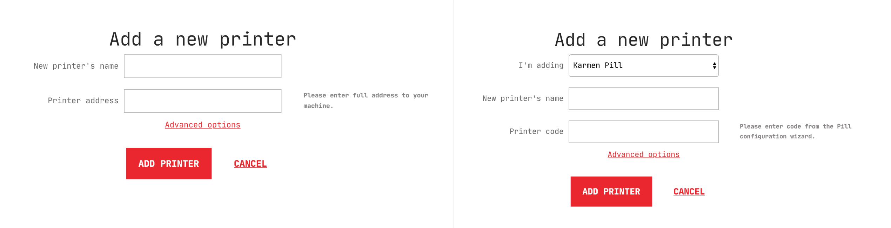
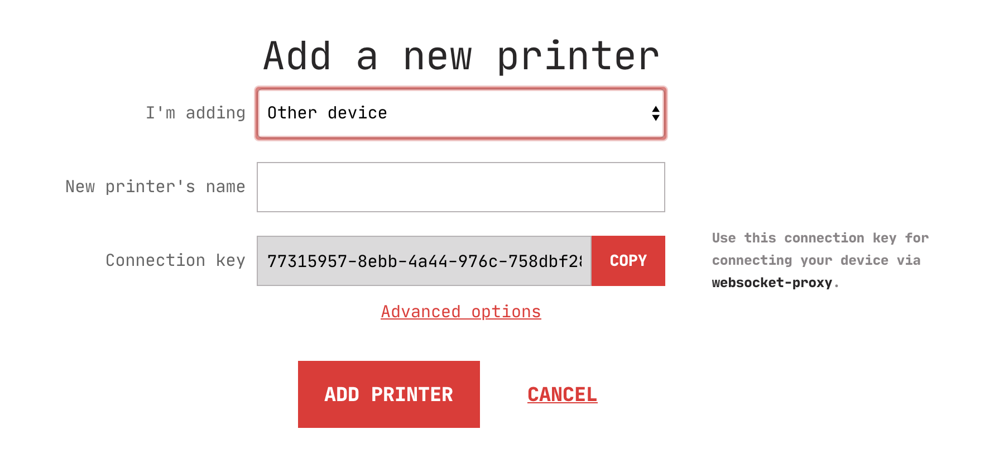

# Managing printers

Each Karmen [organization](access.md?id=managing-organizations) can have its own
fleet of 3D printers assigned. Individual 3d printers can be controller using any
supported [printer connection method](connecting-your-devices.md). Karmen serves
as a central printer management hub integrating all the connected devices into
single user interface.

## Displaying printer list

Your whole printer fleet is easily accessible on the **Printer list** page which
also serves as the entry page of each [organization](access.md). There are two
view types that you can switch between using icons above the listing (top-right
corner).

?> **Tip**: you can access the printer list quickly from everywhere by clicking the
Karmen logo at the top-left of the screen.

### List view

Printers are displayed in a table list with textual information only. This mode is
useful when you need to keep the network bandwith low.

### Grid view

Printers are displayed in a visual grid along with live video feed from each device.
This mode comes handy when you need to visually check what your printers are doing
at the moment.

## Displaying printer status

Each printer has its status page that can be accessed by clicking on the printer in
the list. You can see various useful information there:

- Printer connection status
- Printer live camera feed
- List of print job history
- Basic information about controller client
- Thorough information about current printing job
- Information about potential update for the Karmen Pill you might want to install

You can also perform several actions with the printer controller:

- Toggle to turn on/off the LED lighting (on compatible devices)
- [Start](printing.md?id=starting-new-prints) new prints
- [Pause](printing.md?id=pausing-and-resuming-ongoing-prints) or [cancel](printing.md?id=cancelling-prints) ongoing prints

## Editing printer properties

Once a printer is registered with Karmen, you may define its properties:

* **Loaded filament type**: Karmen will verify it matches the information in the
  print job that is about to start.
* **Loaded filament color**
* **Bed type**
* **Extruder/tool diameter**
* **Note**

We intend to work with these fields intensively in near future to make the
printer management even easier for you. You can edit it by clicking
the **Printer settings** button on the printer detail page.

## Adding new printers

New printers are added in the organization settings. Locate the **Printer settings
page** (open the app menu and click on **Settings**) and click on the **Add a
printer** button. One of following dialogs will be then displayed depending on
your Karmen setup:

*Adding printer is a little different when Karmen runs with cloud mode **disabled** (on the left)/**enabled** (on the right).*

You have to enter your box code or IP address depending on your Karmen setup.
With [cloud mode](on-premise.md?id=configuration) enabled, **Karmen Pill code** (or the connection key if using a raw OctoPrint box)
is required. With cloud mode disabled, **printer IP address** is always required
instead. If you intend to add an OctoPrint box, see [Adding an OctoPrint
device](printers.md?id=adding-an-octoprint-device).

When dealing with IP addresses, it is essential that the **address is reachable by
your Karmen deployment**. Easiest way to make sure is to run both Karmen and
your controllers *on the same network*. If Karmen cannot reach your boxes, it
won't be able to control them.

### Automatic printer discovery

To simplify adding multiple devices, Karmen can scan for the compatible ones if they
are connected to the same network. The discovery mode will
[scan](https://linux.die.net/man/1/arp-scan) a configured network interface
for all devices and tries to call the common HTTP(S) ports to discover a compatible
3D printer service such as OctoPrint. If it finds one, it adds it automatically
to Karmen. This feature is only available when running Karmen deployment with
[cloud mode](on-premise.md?id=configuration) disabled.

You can start the automatic discovery process on the **Organization settings**
page under the **Printers** tab. You will be asked to select which network
interface to use. When finished, the printers will be added automatically to
your fleet.

### Adding a Karmen Pill

Adding your Pill to Karmen is as easy as it gets. Simply fill up your desired
printer name and enter the Pill token in the Printer token field (or its IP
address as mentioned above) you got when you ran the [initial
configuration](pill-getting-started.md?id=initial-configuration). You can left
the API key field empty, it is not mandatory for Pill boxes. Confirm addition by
clicking **Add printer** and you're good to go.

!> Can't remember the token your Pill was initialized with? See the
[Troubleshooting](pill-troubleshooting.md?id=recovering-a-lost-pill-token)
section on how to recover it.

### Adding an OctoPrint device

Karmen supports common OctoPrint boxes like the popular
[OctoPi](https://github.com/guysoft/OctoPi) bundle for Raspberry Pi. To add your OctoPrint box, just select
*Other device* instead of Karmen Pill in the *I'm adding* field.

Compared to Karmen Pill, the setup is a little more difficult since you will
need to teach your box how to establish a connection with our public
[websocket-proxy](https://github.com/fragaria/websocket-proxy) instance in order
to avoid difficult networking challenges—a feature that Karmen Pill is bundled
with out from the box. The public instance address is
`https://cloud.karmen.tech/octoprint-connector`. You will also need the
connection key which will be automatically generated for you in the *Connection
key* field while adding your printer.

After adding your printer, you will need to install the
[karmen-octoprint-connector](https://github.com/fragaria/karmen-octoprint-connector)
utility and run it on your machine against our public websocket proxy instance
using the *Connection key*. Also, to enable your webcam in Karmen, you will need
to tweak your OctoPrint settings a little bit.

We've thoroughly described the procedure in our blog post which we **strongly
encourage** you to read first.

### Using OctoPrint access control

Both Karmen Pill and raw OctoPrint boxes can be used with OctoPrint [access
control]((http://docs.octoprint.org/en/master/features/accesscontrol.html#sec-features-access-control)
enabled. In such case, expand the **Advanced options** when adding your printer and
provide Karmen with the API key for
[authorization](http://docs.octoprint.org/en/master/api/general.html#authorization)
as well. If you're not sure how to get one, see **Application Keys Plugin**
section in the [OctoPrint
docs](http://docs.octoprint.org/en/master/bundledplugins/appkeys.html#sec-bundledplugins-appkeys).

## Removing printers

You can remove a printer on the **Printer settings page** (open the app menu and
click on **Settings**). To remove it, use the context menu on the respective
printer listing item.
