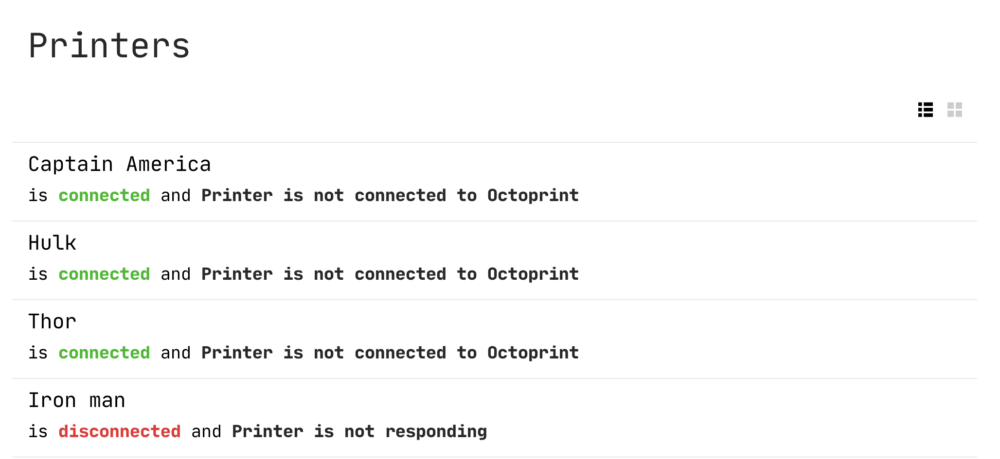
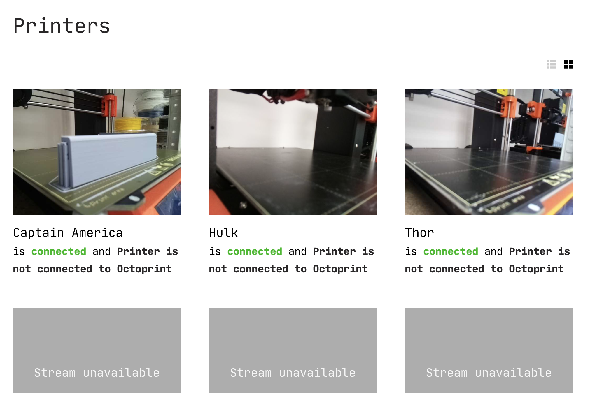
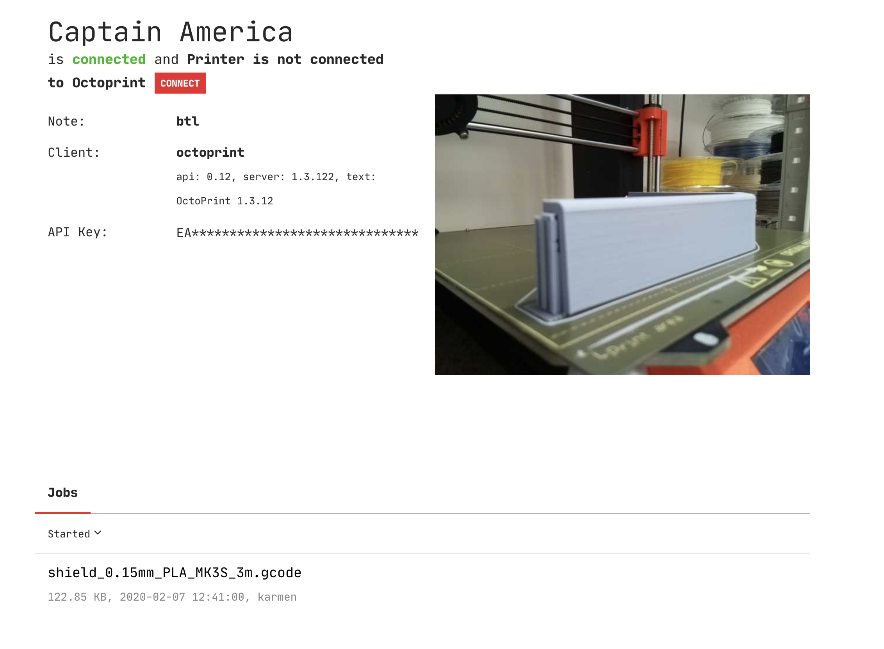
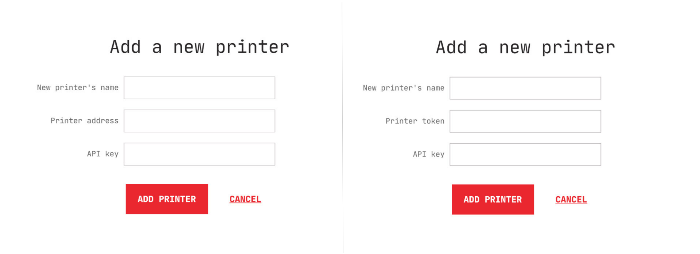

# Managing printers

Each Karmen [organization](access.md?id=managing-organizations) has its own
fleet of 3d printers assigned. Individual 3d printers can be controller using any
supported [printer connection method](connecting-your-devices.md). Karmen serves
as a central printer management hub integrating all the connected devices into
single user interface.

## Displaying printer list

Your whole printer fleet is easily accessible on the **Printer list** page which
also serves as the entry page of each [organization](access.md). There are two
view types that you can switch between using icons above the listing (top-right
corner).

### List view

Printers displayed in a table list with textual information only. This mode is
useful when you need to keep the network bandwith low.

### Grid view

Printers displayed in a visual grid along with live video feed from each device.
This mode comes handy when you need to visually check what your printers are doing
at the moment.

## Displaying printer status

Each printer has its status page you can display by clicking on the printer in
the list. You can view various useful information there:

- Printer connection status
- Printer live camera feed
- Toggle to turn on/off the LED lights (on Karmen Pill)
- List of print job history
- Basic information about controller client

## Editing printer properties

Once printer is registered with Karmen, you define its properties:

* **Loaded filament type**: Karmen will verify it matches the information in the
  print job that is about to start.
* **Loaded filament color**
* **Bed type**
* **Extruder/tool diameter**
* **Note**

We intend to work with these fields intensively in near future to make the
printer management even easier for you. You can edit it by clicking
the **Printer settings** button on the printer detail page.

## Adding new printers

New printers are added in the organization settings. Locate the **Printer settings
page** (open the app menu and click on **Settings**) and click on the **Add a
printer** button. One of following dialogs will be then displayed depending on
your Karmen setup:

*Adding printer is a little bit different when Karmen runs with cloud mode **disabled** (on the left)/**enabled** (on the right).*

You have to enter your box token or IP address depending on your Karmen setup.
With [cloud mode](on-premise.md?id=configuration) enabled, **Karmen Pill token**
is required. With cloud mode disabled, **box IP address** is required instead.
Please note that running in cloud mode currently means you can only use Karmen
Pill boxes. If you intend to connect OctoPrint boxes, too, you need to disable
the cloud mode (see reasons behind this in the box below). This doesn't mean
your Karmen Pill boxes won't work. You simply enter their IP address instead of
tokens and they will work just fine. Also note that our hosted Karmen option
runs in cloud mode. Therefore, we only support Karmen Pill devices on
[cloud.karmen.tech](https://cloud.karmen.tech) at the time of this writing.

!> OctoPrint-based boxes are currently supported only when running Karmen on your [own
server](on-premise.md) with the [cloud mode](on-premise.md?id=configuration)
disabled. The reason behind this is *networking*. In order to avoid complicated
settings on you router, the Karmen SaaS needs a special [web socket
proxy](https://github.com/fragaria/websocket-proxy) to be running on the
controller device. We plan to describe how to setup this in near future on your
custom OctoPrint boxes too, so that you will be able to connect your existing
devices even in cloud mode.

When dealing with IP addresses, it is essential that the **address is reachable by
your Karmen deployment**. Easiest way to make sure is to run both Karmen and
your controllers *on the same network*. If Karmen cannot reach your boxes, it
won't be able to control them.

### Adding a Karmen Pill

Adding your Pill to Karmen is as easy as it gets. Simply fill up your desired
printer name and enter the Pill token (or its IP address as mentioned above) you
got when you ran the [initial
configuration](pill-getting-started.md?id=initial-configuration). You can left
the API key field empty, it is not mandatory for Pill boxes. Confirm addition by
clicking **Add printer** and you're good to go.

!> Can't remember the token your Pill was initialized with? See the
[Troubleshooting](pill-troubleshooting.md?id=recovering-a-lost-pill-token)
section on how to recover it.

### Adding an OctoPrint device

Adding OctoPrint device always means using its IP address. In case your
OctoPrint box is
[password-protected](http://docs.octoprint.org/en/master/features/accesscontrol.html#sec-features-access-control)
(which is always a good idea!), you will also need to provide Karmen with an
OctoPrint API key to use for
[authorization](http://docs.octoprint.org/en/master/api/general.html#authorization).
API key can be obtained using the Application Keys Plugin as mentioned in the
[OctoPrint
docs](http://docs.octoprint.org/en/master/bundledplugins/appkeys.html#sec-bundledplugins-appkeys).

## Removing printers

You can remove a printer on the **Printer settings page** (open the app menu
and click on **Settings**). Then, remove your printer using a context menu on
the respective printer listing item.
