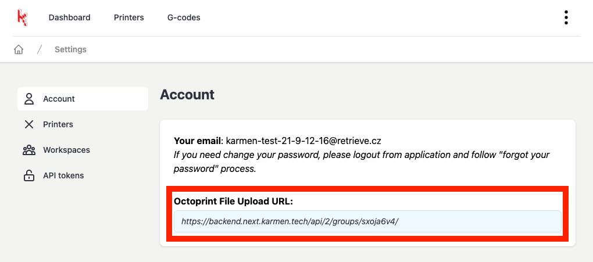
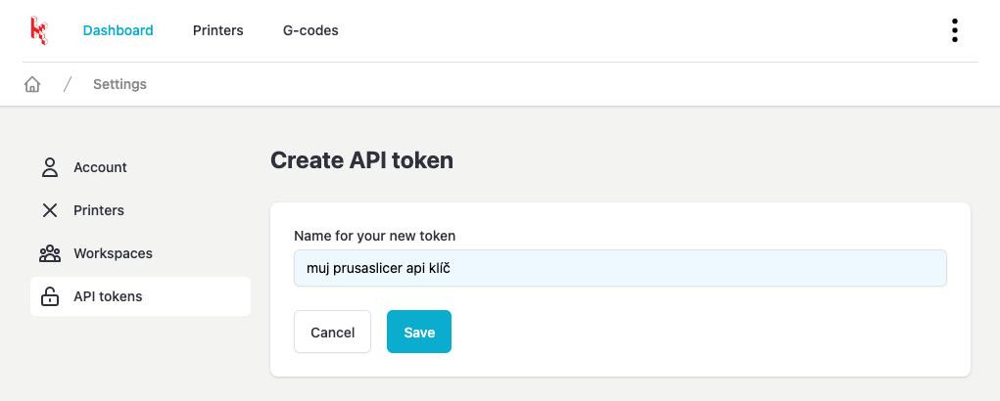
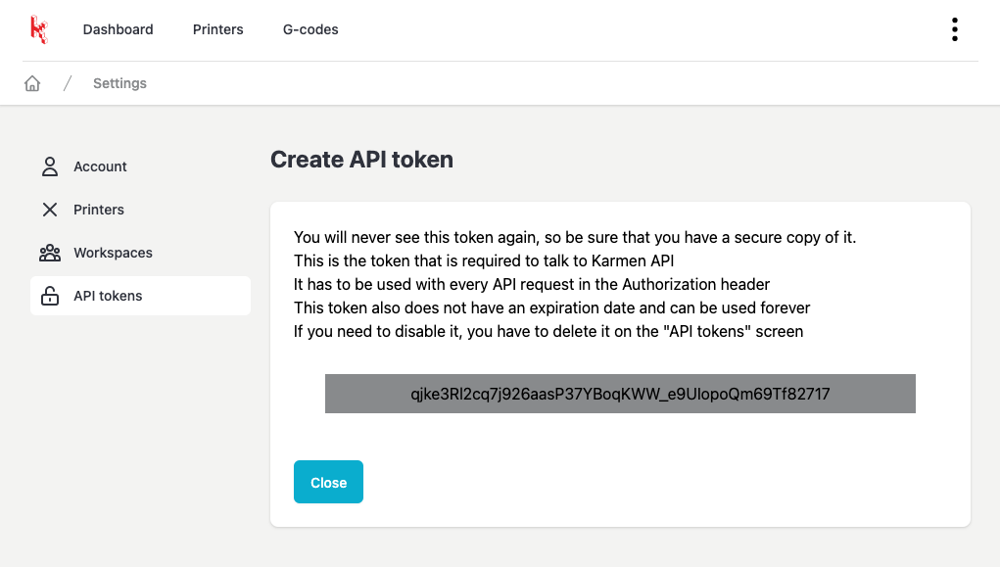
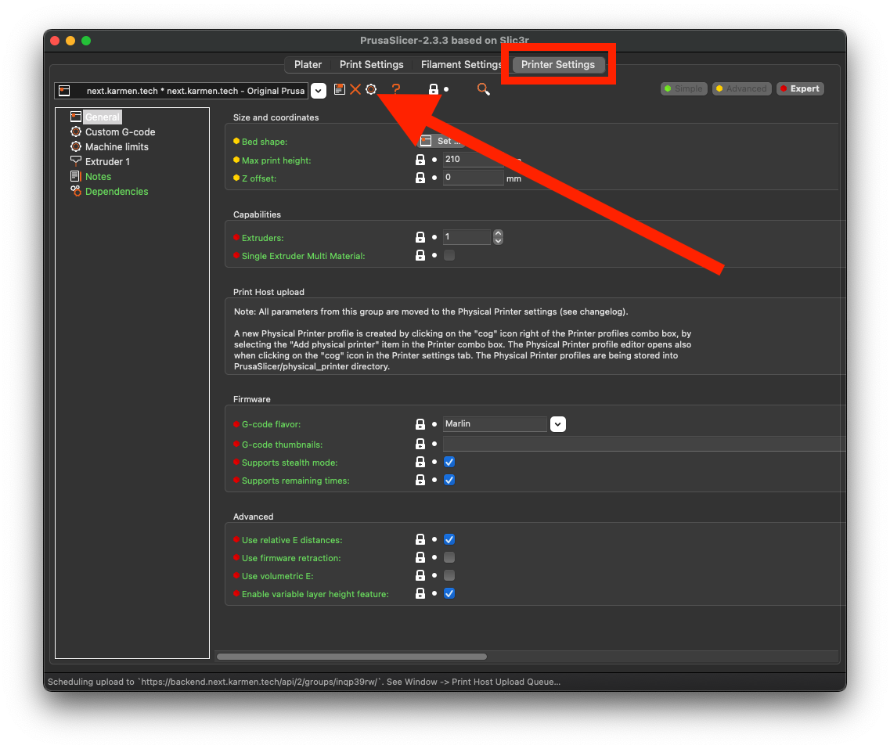
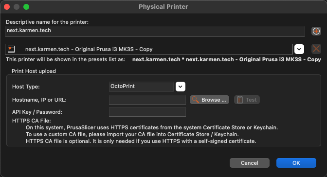
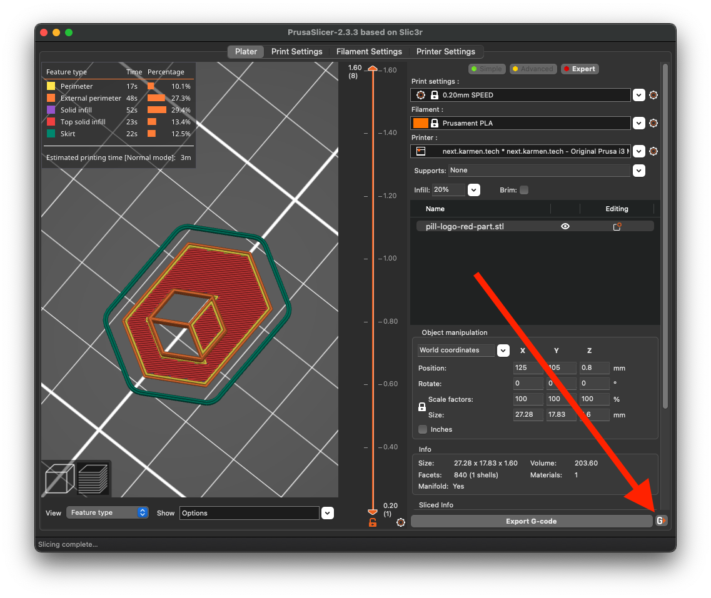

# PrusaSlicer and Karmen

If you use [PrusaSlicer](https://www.prusa3d.com/prusaslicer/) for slicing, you will certainly be interested in the fact that you can send your print files (Gcodes) from PrusaSlicer directly to Karmen.

!> This tutorial is made for PrusaSlicer version [2.3.3](https://github.com/prusa3d/PrusaSlicer/releases/tag/version_2.3.3). If you have a different version, some steps may be different.

> Tip: Karmen can also communicate with other slicers (Cura...). The setting is similar to the one below - if it doesn't work for you, contact us.

## Octoprint server address

In order for PrusaSlicer to upload files directly to Karmen, we will need the server address in the next parts of the tutorial. You can view the server address in your account settings.

<borderedImage></borderedImage>

## Create API token

In order for PrusaSlicer to communicate with Karmen (send Gcody), you must first generate an API key.
You create an API key in the settings in Karmen Cloud on the page [Settings > API tokens](https://next.karmen.tech/settings/api-tokens).

> Tip: In the field with the name of the key, enter a text from which you will know in the future what the given key is used for.

<borderedImage></borderedImage>

A page will then appear with the key that we will need later.

<borderedImage></borderedImage>

> Tip: For now, keep the page with the display API key open - after switching to another page or closing the Internet browser, the key cannot be displayed again. However, you can optionally create a new API key.

## PrusaSlicer settings

In the "Printer Settings" tab, click the printer settings icon:

<borderedImage></borderedImage>

In the printer settings window, enter:

- Host Type: ```OctoPrint ```
- Hostname: ```see "Octoprint Upload Url" in doc above ``` - [Octoprint server address](prusaslicer-gcode-upload?id=octoprint-server-address)
- API Key: ```the key you created in one of the previous steps``` - [Create API token](prusaslicer-gcode-upload?id=create-api-token)

<borderedImage></borderedImage>

> Tip: To verify correct communication between PrusaSlicer and Karmen, click the test button in the settings dialog.

## Sending Gcode to Karmen

At this point you should have PrusaSlicer set up so that it is able to communicate with Karmen. When you have the model ready for printing, a new button appears in the lower right corner of PrusaSlicer for uploading the Gcode directly to Karmen.

<borderedImage></borderedImage>


