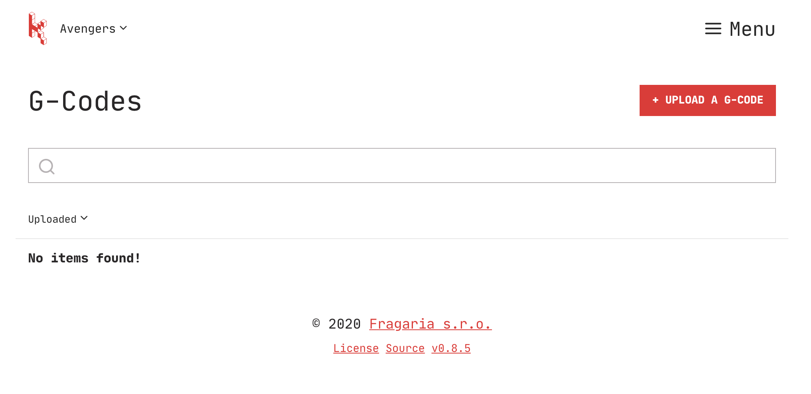
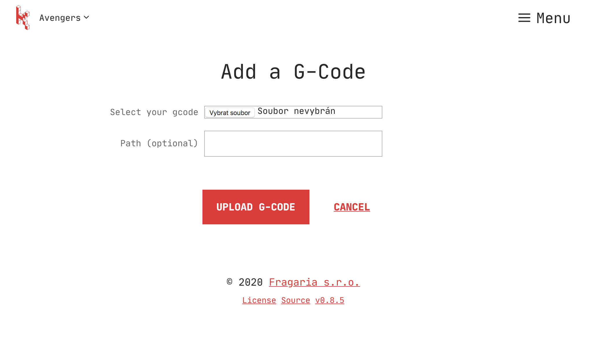
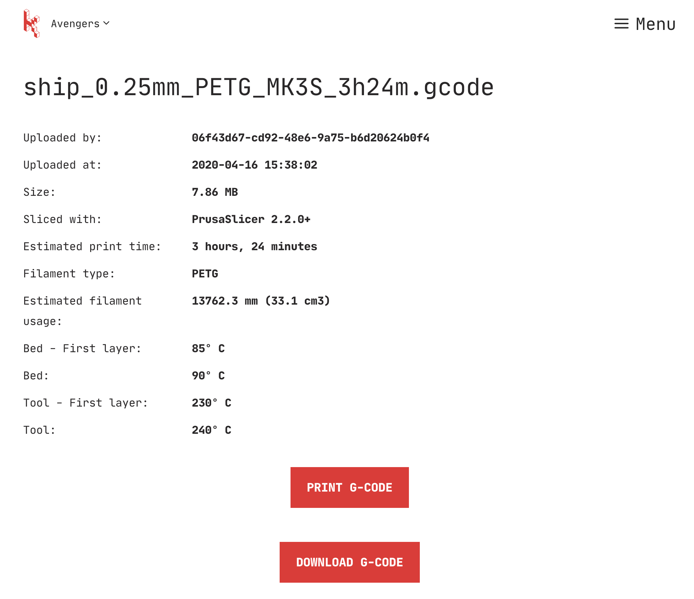

# Quickstart

This page will guide you through your first steps with Karmen. It assumes you
have already [signed up](https://cloud.karmen.tech/register) and requires no
special knowledge of computers. We'll cover following areas in this guide:

1. Preparing a print file and uploading it to Karmen
2. Printing it with Karmen

After you complete the quickstart, you should have learn all the necessary
basics to start using Karmen on daily basis and be ready to start digging
deeper in more advanced stuff like [managing user access](access.md) or
[connecting other devices like OctoPrint
boxes](printers.md?id=adding-an-octoprint-device).

This quickstart also assumes you have a printer already registered with Karmen.
If you've just received your Karmen Pill haven't set it up yet, you will first
need to do so. If that's the case, please run through [Getting started with
Karmen Pill](pill-getting-started.md) and return back here once you finish.

## Preparing a print file

Karmen controls what your printers do. To be able to command them to acutally
print something, it needs the print file to read the instructions from: a
[G-code](https://reprap.org/wiki/G-code) file. Since you're probably not new to
the 3D printing industry, this term should be familiar to you. G-codes are
typically obtained using a slicing software that will generate them for you from
the CAD models you throw at them (these can be formats like `.STL`, `.OBJ` etc).

!> If your printer isn't capable of processing G-code files, your printer
unfortunately cannot work with Karmen.

So, the first thing you should do is to create new G-code file using your slicer. As
Karmen only deals with G-codes, it is compatible with wide range of slicers like
[PrusaSlicer](https://www.prusa3d.com/prusaslicer/),
[Slic3r](https://slic3r.org/) or
[Cura](https://ultimaker.com/software/ultimaker-cura). We won't discuss the
process of slicing your model—we're quite confident you already know how to do
this on your own. You wouldn't be here otherwise, right?

Once you have your `.gcode` file ready, you need to upload it to Karmen. Fire up
the app menu (available on the top right of the screen) and select the
**G-codes** link. This will lead you to your *G-codes library*. G-codes
library keeps record of your previous G-codes and makes it simple to print
whatever you've uploaded previously.

However, in our case it's empty—we've not uploaded our `.gcode` file yet. To do so,
click the **Upload a G-code** button. You will be presented with an upload dialog:

Select your `.gcode` file and upload it. If your file is big, it might take
couple seconds to finish depending on your network upload speed so be patient
please. When upload completes, the G-code detail will be shown.

## Printing with Karmen

You can print your `.gcode` file right from the G-code detail page.
Alternatively, you can initiate the same action from the G-code library
listing any time in the future. Right now though, we want to proceed with the
print. Click on the **Print G-code** button.

**TODO: add missing image to illustrate this**

You will be requested to select the printer you want to print this file on.
Since you only have one printer registered, the choice is quite obvious. Later,
when you register more printers (should you want to), you can pick the right one
for the job—taking loaded filament type into consideration for example.

As soon as you hit the **Print** button, your print will be scheduled and
notification confirming this will appear. **Congratulations, you've just started
your first print remotely with Karmen!**

What's next? Well, it's always a good idea to see how your printer is doing
especially in the beginning of the print. You can quickly get to the printer
overview page from anywhere by clicking the Karmen logo at the top-left of the screen.

**TODO: add missing image to illustrate this**

You can try switching the view from the default [list
view](printing.md?id=list-view) to [grid view](printing.md?id=grid-view). The
grid view is great for monitoring all your printers visually at the same time!
When you click on your printer, you can also review all the important little
details (like ETA, print progress, extruder temperature etc.).

If you've read this far, you now know everything you need to use Karmen instead of
oldschool SD cards to transfer your `.gcode` files. But Karmen offers much more:

- See [Managing g-codes](gcodes.md) to learn how to upload G-codes directly from
  your slicer besides the manual upload method described above
- See [Printing](printing.md) to learn more details on how to manage ongoing
  prints (like pausing and cancelling)
- See [Managing access & organization](access.md) to learn how to use Karmen in
  larger teams
- See [Managing printers](printers.md) to learn how to connect more printers
  efficiently
- See [Installing on-premise](on-premise.md) if you want to learn how to install
  Karmen on your own server
