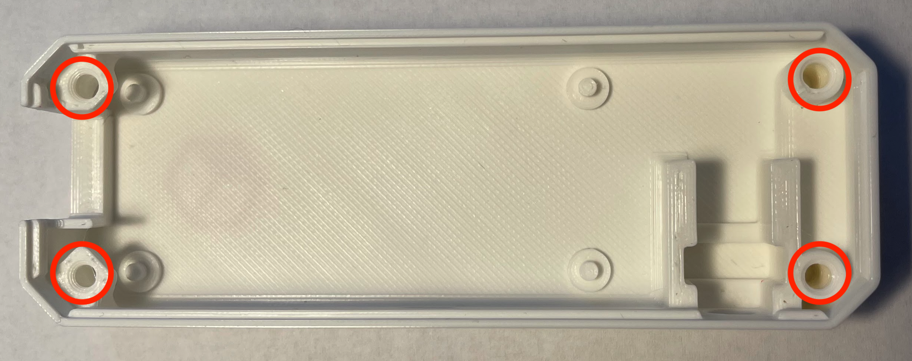
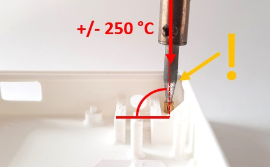
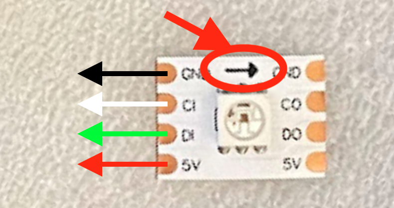
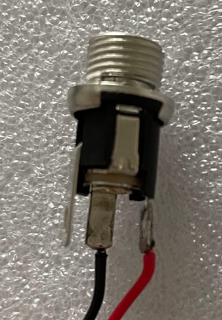
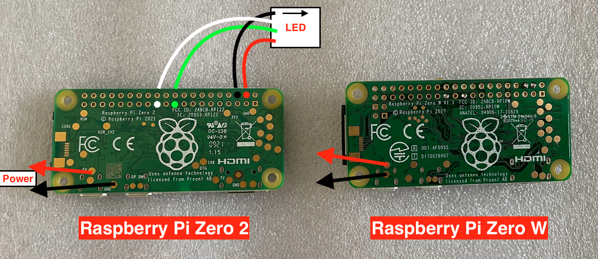
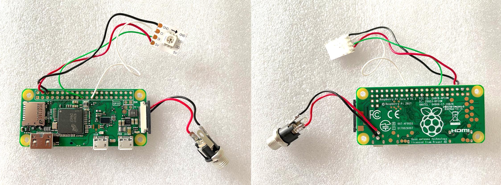
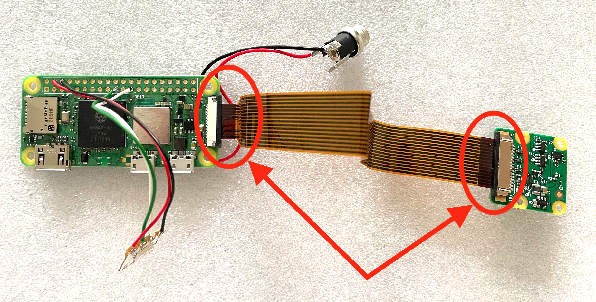
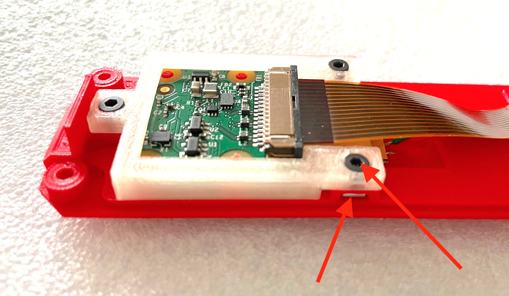
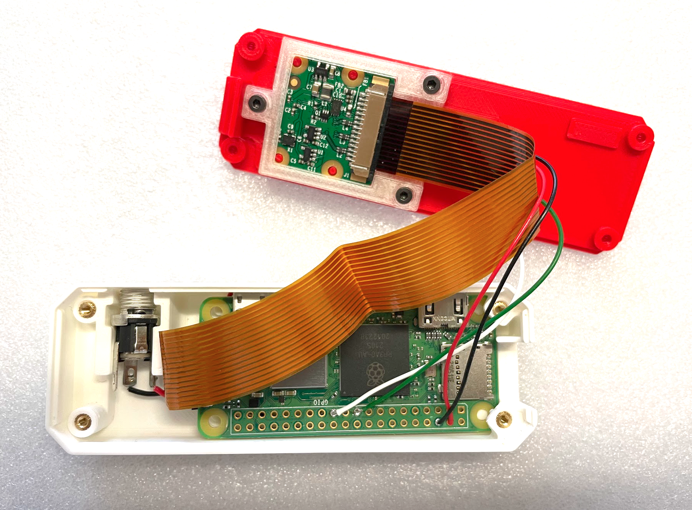
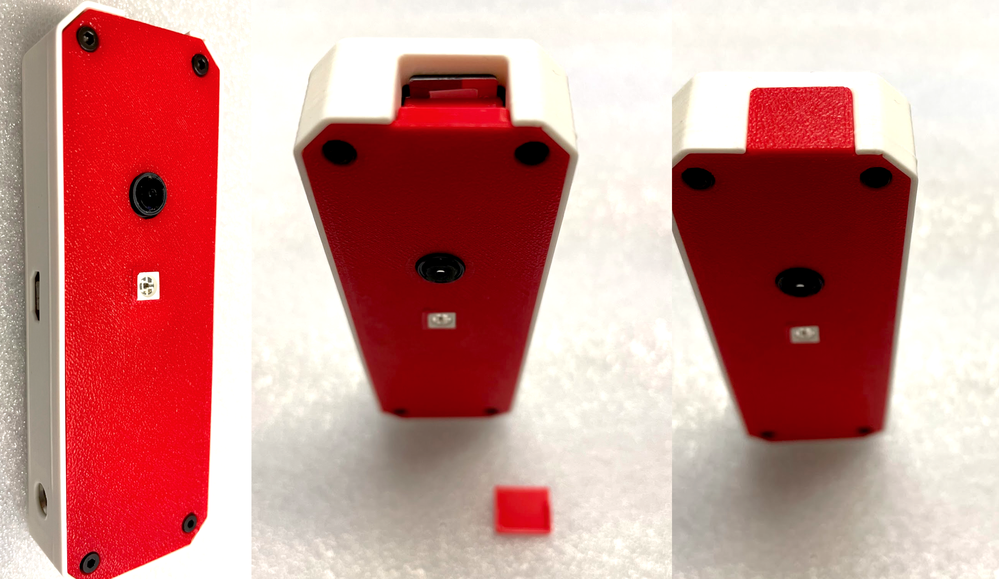

# Jak si sestavit vlastní Karmen Pill

Gratulujeme k tomu, že jste se rozhodli postavit vlastní Karmen Pill! Na dalších řádcích naleznete podrobný návod, jak postupovat při jejím sestavování.

## Obsah balení

- **A**: Sada vytištěných dílů Karmen Pill
    - A1: Spodní část krabičky
    - A2: Víčko
    - A3: Držák kamery
    - A4: Venkovní krytka SD karty
- **B**: Kamera s kabelem a ostřící kolečko
- **C**: Napájecí adaptér
- **D**: LED - 1ks
- **E**: Spojovací materiál
    - 4ks - závitové vložky M2 (délka 4mm)
    - 7ks - šrouby M2x4 (DIN 912)
    - 3ks - čtercové matice M2
- **F**: Napájecí konektor
- **G**: Sada vodičů k připojení LED
- **H**: Sada vodičů k připojení napájecího konektoru
- **I**: Základní deska (Raspberry Pi Zero W nebo Raspberry Pi Zero 2)
- **J**: Propojovací USB kabel pro připojení Karmen Pill s tiskárnou
- **K**: SD karta se systémem

<borderedImage></borderedImage>

## Potřebné vybavení

- Pájka (nejlépe mikropájka s úzkým hrotem)
- Pomocné držáky pro pájení (třetí ruka)
- Imbus velikost 1.3 mm

## Lisování závitových vložek

Součástí stavebnice jsou závitové vložky, takže vše je možné opakovaně složit a rozebrat.

### Pozice závitových vložek

 Umístění závitových vložek je následující - viz obrázek níže.

<borderedImage></borderedImage>

### Způsob lisování

Nejlepší způsob jak nalisovat závitové vložky je za pomoci pájky. Nahřejte pájku zhruba na 250°C a opatrně umístěte závitovou vložku na její hrot. Tím se vložka rychle zahřeje a vy budete schopni nalisovat vložky bez rizika popraskání plastových dílů.

!> Při lisování musí být pájka v jedné ose se závitovou vložkou a otvorem, do kterého je vložka lisována (jinými slovy kolmo na dno krabičky) - jedině tak nedojde ke kontaktu pájky s lemem krabičky a tím k jeho natavení na zahřátou pájku. Nesousosost by také vedla k vyvalení materiálu z prostoru kolem vložky, případně ke znemožněnému sešroubování.

<borderedImage></borderedImage>

!> Každá závitová vložka musí být zalisována po celé délce tak, aby nevyčnívala.

## Pájení kontaktů

Karmen potřebuje propojit LEDky a konektor se základní deskou - není to nic složitého, stačí Vám trocha trpělivosti.

!> Pro správnou funkci se držte schéma zapojení LED a konektoru se základní deskou. Dodržujte barevné uspořádání přiložených vodičů znázorněné na následujících obrázcích.

### Zapojení LED

Na obrázku níže je zvýrazněna šipka, která ukazuje směr zapojení vodičů, resp. otočení LEDky. Dejte pozor, abyste připojili vodiče na správnou stranu LED.
Doporučujeme při zapojení dodržet barvy vodičů dle obrázku, další části návodu s tímto rozložením počítají.

<borderedImage></borderedImage>

### Zapojení napájecího konektoru

Konektor má 3 vidlice, z toho budou potřeba pouze 2 - prostřední pro připojení černého vodiče a levá pro připojení červeného vodiče (levá strana platí pro prostřední vidlici v dolní poloze).

<borderedImage></borderedImage>

### Zapojení vodičů na základní desce

Pro vodiče napájecího konektoru slouží testovací pady na spodní straně Raspberry. Mezi "Raspberry Zero W" a "Raspberry Zero 2" je drobný rozdíl v umístění padů, což je vidět na obrázku níže - zbytek zapojení je stejný.

!> Při pájení vodičů od napájecího konektoru dodržte směr vedení vodičů, jak je označeno na obrázku - předejdete tak jejich lámání při sestavování.

Pro LED vodiče slouží standardní Raspberry piny - způsob jejich zapojení je opět vidět na obrázku. Vodiče věďte z horní části desky - na spodní straně desky by měl vodič vyčnívat jen minimálně, tak aby nebránil vložení do krabičky.

<borderedImage></borderedImage>

### Výsledek

Nyní by mělo vše vypadat cca následovně...

<borderedImage></borderedImage>

## Sestava

To nejtěžší bychom měli mít za sebou! Teď vše poskládáme dohromady.

### Připojení kamery

Nyní je čas připojit k Raspberry kameru. Dejte pozor, aby kabel v konektoru byl správně natočen - kontakty směrem dolů - jak u kamery, tak u Raspberry.
Nezapomeňte opatrně zajistit oba konektory, aby z nich kabel nevypadával.

<borderedImage></borderedImage>

### Montáž kamery do horní části krabičky

Pomocí tří šroubů a čtvercových matic, přišroubujte kameru do víčka krabičky.

<borderedImage></borderedImage>

### Vložení napájecího konektoru a Raspberry do krabičky

!> Ujistěte se, že SD karta není vložena do základní desky, v opačném případě by při sestavování mohlo dojít k jejímu poškození!

Nyní je čas vložit do krabičky samotné Raspberry. Postupujte tak, že nejprve zasuňte do krabičky tu část, kde je otvor pro SD kartu. Při vkládání je potřeba krabičku po stranách trochu prohnout směrem ven, aby tam Raspberry prošlo.

Když vše dobře sedí, tak zasuňte do pozice napájecí konektor.

Při vkládání Raspberry buďte opatrní a dávejte pozor na kamerový kabel a vodiče od napájecího konektoru, aby nebránili "zapadnutí" Raspberry až dolu.

<borderedImage></borderedImage>

### Konečná montáž

Nyní přiložte víčko na krabičku a dotáhněte pomocí 4 šroubů. Dbejte na to, aby na sobě vše dobře "sedělo", případně zkuste porovnat vodiče a kabel od kamery,
aby nic z toho nebránilo hladkému sesazení.

### Finále

Jako úplně poslední krok vložte SD kartu a schovejte jí pod krytku.

<borderedImage></borderedImage>

---
---
---

## TODO:
- instalace SD karty
- přidání Karmen Pillu do Karmen Cloudu
