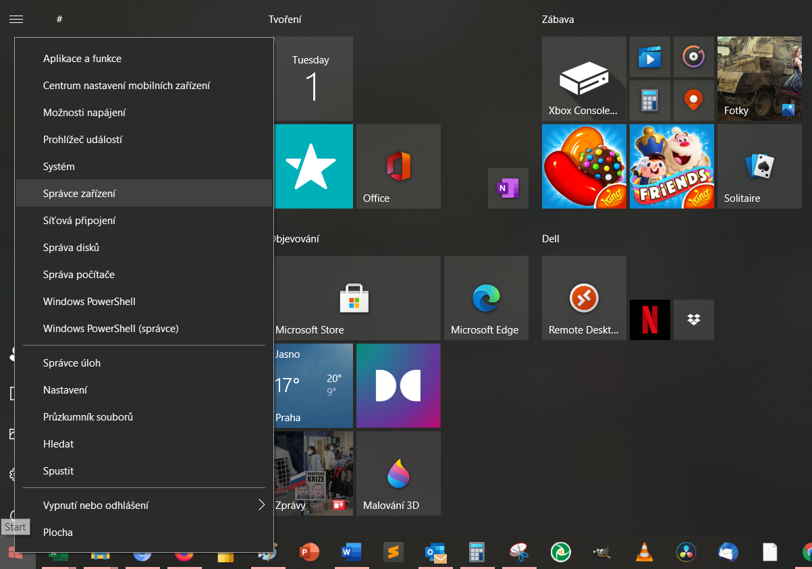
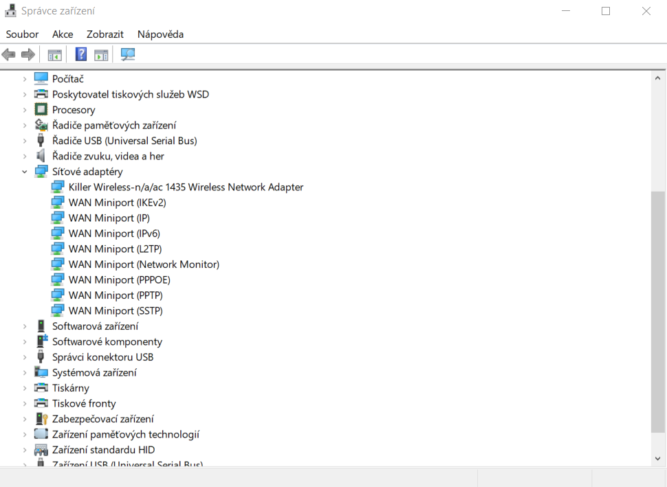
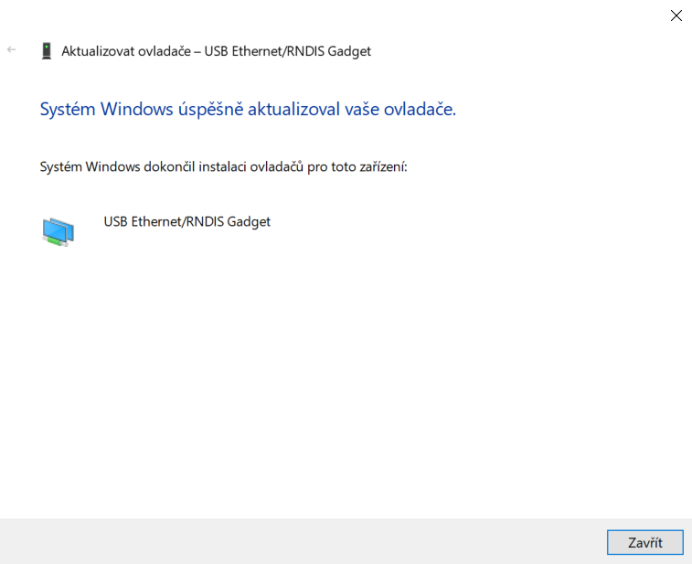

# Úvodní zapojení Karmen Pill na zařízení s Windows

Pokud používáte zařízení s operačním systémem Windows, bude třeba nejprve stáhnout ovladač, který v tomto operačním systému chybí.

## Spojení Pillu s počítačem

Nejprve připojte Pill k počítači dodaným USB kabelem. Pozor, pokud využijete vlastní kabel, dbejte na to, aby umužňoval přenášet data a nebyl pouze nabíjecí.
Počkejte až se Pill modře rozsvítí a následně zhasne.
Potom přejděte na URL pro [stažení ovladače](https://www.catalog.update.microsoft.com/Search.aspx?q=usb%20vid_0525%20pid_a4a2).

<borderedImage></borderedImage>

Zobrazí se stránka pro stažení ovladače. Ovladač stáhněte a dobře si zapamatujte místo, kam jej ukládáte.

<borderedImage></borderedImage>

## Instalace ovladače

Pravým tlačítkem klikněte na Start a vyberte ```Správce zařízení```


<borderedImage></borderedImage>

Pod možností ```Síťové adaptéry``` se podívejte, zda vidíte "USB Ethernet/RNDIS Gadget". To je ovladač, který je třeba nainstalovat.

<borderedImage></borderedImage>

Nyní rozklinete ```PORTY (COM A LPT)```, kliknete pravým tlačítkem na ```Sériové zařízení USB``` a zvolte Aktualizovat ovladač.

<borderedImage></borderedImage>


!> Nevidíte PORTY (COM A LPT)? [Podívejte se sem](porty.md).


Dále z nabízených možností zvolte ```Vyhledat ovladače na mém počítači``` a

<borderedImage></borderedImage>

pomocí tlačítka ```Procházet``` najděte složku, kam jste stažený ovladač uložili (předtím jej bude potřeba nejspíše rozbalit).


<borderedImage></borderedImage>

<borderedImage></borderedImage>

Nyní Pill odpojte, znovu připojte a měli byste jej vidět jako ```USB Ethernet/RNDIS Gadget``` v ```Síťových adaptérech```.

<borderedImage></borderedImage>
